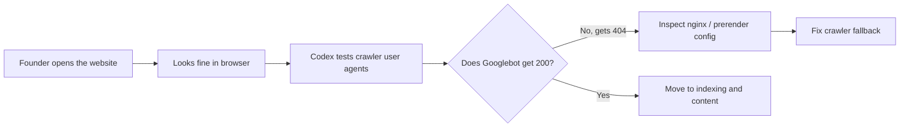

# Day 1 — Before Content, Make Sure Google Can See the Site

Date: 2026-06-18

Stage: Week 1 — Foundation

Status: Completed


## Context

The first instinct in a 30-day growth plan is usually to publish content.

Write blog posts. Submit directories. Post on X. Launch a community.

But for SandBase, we started with a more basic question:

```text
Can search engines actually see the site?
```

SandBase is a developer infrastructure product. If Google cannot reliably crawl the homepage, then every later SEO effort becomes fragile:

- blog posts may be discovered slowly
- internal links may not pass meaning
- sitemap submissions may look successful while key pages fail
- social previews may break
- brand queries may not resolve cleanly

So Day 1 was not about writing more content.

Day 1 was about crawlability.

## Goal

Run a surface-level SEO and crawlability audit for `sandbase.ai`, then identify any P0 issue blocking indexing.

The goal was not to make the site perfect. The goal was to answer:

1. Does the site have basic SEO infrastructure?
2. Does Google Search Console see the sitemap?
3. Do important pages return the right status codes?
4. Do bots and normal users see the same thing?
5. Is there any root cause that should be fixed before asking Google to index more pages?

## Beginner View

If you are new to SEO, think of Day 1 like checking whether the front door of your store is open.

You can write great articles later, but if Googlebot walks up to the site and gets a `404`, the content engine starts with a broken foundation.

The simple version:

```text
Before asking Google to rank the site, make sure Google can load the site.
```

## Visual Map



## Tools Used

| Tool | Role | How it was used |
|------|------|-----------------|
| Codex | Technical SEO auditor | Inspected site behavior, reasoned through nginx and prerender logic, documented findings |
| Google Search Console | Indexing source of truth | Checked domain property, sitemap, and URL inspection status |
| curl / user-agent checks | Crawl simulation | Compared normal browser behavior with Googlebot, Bingbot, and social crawler user agents |
| Repository code search | Root-cause analysis | Traced crawler behavior to nginx prerender configuration |
| Browser | Manual verification | Checked what a normal visitor saw versus what crawler checks reported |

## How Codex Helped

Codex was useful here because the problem was not visible from the normal website.

For a human visitor, the homepage loaded.

For a crawler, the homepage returned `404`.

That is the kind of issue that is easy to miss if you only test the site as a user.

Codex helped by:

1. Comparing normal requests and crawler user-agent requests
2. Reading the nginx configuration
3. Identifying the prerender route used for bots
4. Tracing why that route fell through to `404`
5. Turning the finding into an engineering fix and a Day 2 verification plan

The important lesson: AI assistance is strongest when it can connect live behavior to source code.

## What We Found

At first, the site looked healthy:

- Google Search Console domain property existed
- `robots.txt` was present
- `sitemap-index.xml` was present
- The sitemap was submitted successfully
- Search Console had discovered hundreds of URLs
- Some pages already had impressions
- The homepage loaded normally in a browser

But the URL inspection result showed a serious issue:

```text
Page not indexed: Not found (404)
```

The problem appeared on homepage variants:

- `http://sandbase.ai/`
- `https://www.sandbase.ai/`

Then we tested different user agents.

## The Critical Discovery

Normal visitors received `200`.

Important crawlers received `404`.

| User agent | Homepage result |
|------------|-----------------|
| Chrome / normal browser | 200 |
| curl / normal request | 200 |
| Googlebot | 404 |
| Bingbot | 404 |
| Facebook external hit | 404 |
| LinkedInBot | 404 |
| Sitemap as Googlebot | 200 |

This was the P0 issue.

The site was not simply "not indexed yet." It was serving a broken response to the exact crawlers we needed.

## Root Cause

The root cause was in the dashboard nginx configuration.

The site had special prerender logic for crawler user agents:

```text
Crawler user agent
  ↓
nginx marks request for prerender
  ↓
/ gets rewritten to /prerender/index.html
  ↓
prerender file does not exist
  ↓
crawler receives 404
```

Why the prerender file did not exist:

- The Docker build ran `npm run build`
- It did not run the prerender script
- The required prerender dependencies were not fully wired into the build path
- The prerender script's file naming did not match what nginx expected for nested routes

So human visitors got the SPA fallback, but crawlers were routed into a missing prerender path.

That is a dangerous SEO bug because it hides behind a normal-looking website.

## What We Fixed

The short-term fix was not to build a perfect prerender pipeline immediately.

The P0 fix was:

```text
Crawler should receive 200, not 404.
```

The nginx behavior was changed so that missing prerender snapshots fall back to the SPA entry instead of returning `404`.

The prerender naming logic was also corrected so future prerender output can align with nginx route expectations.

This means Google can at least receive a valid page and render JavaScript, even if full static prerendering is improved later.

## Decisions

### We did not start by writing new blog posts

New content would not help if Googlebot could not reliably access the site.

The first job of SEO is not keywords. It is crawlability.

### We did not submit more indexing requests yet

Requesting indexing before fixing the `404` would waste crawl opportunities.

The right order:

1. Fix crawler status
2. Deploy
3. Verify with Googlebot user agent
4. Request indexing

### We did not replace the sitemap

The sitemap was not the root cause.

The sitemap index was already reachable. The problem was page rendering for crawler user agents.

## Output

Public output:

- No public post yet

Internal output:

- SEO audit notes
- P0 crawler bug identified
- nginx prerender fallback fix
- Day 2 verification plan

## What We Learned

### 1. A page can work for users and fail for bots

This is especially common in SPA, prerender, CDN, and bot-detection setups.

Never assume a browser `200` means Googlebot gets a `200`.

### 2. Sitemap success does not guarantee page success

Search Console can accept a sitemap while individual pages still fail inspection.

Always inspect the homepage and key pages directly.

### 3. Bot-specific behavior is dangerous

If bots go through a special rendering path, that path must be tested like production.

In this case, the special bot path was less reliable than the normal human path.

### 4. Technical SEO is engineering

This was not a copywriting problem. It was a deployment and routing problem.

For infrastructure startups, SEO often crosses into nginx, routing, build systems, redirects, and runtime behavior.

## Replicable Playbook

If you are starting SEO for a technical product, do this before publishing more content:

1. Verify Search Console domain property.
2. Submit sitemap.
3. Inspect the homepage in Search Console.
4. Test homepage with normal user agent.
5. Test homepage with Googlebot user agent.
6. Test important route pages, not only `/`.
7. Compare `www` and non-`www`.
8. Compare `http` and `https`.
9. Check `robots.txt`.
10. Check canonical URL.
11. If bot behavior differs, inspect server/CDN/prerender configuration.

Do not move to content production until the homepage returns cleanly for crawlers.

## Next Actions

Day 2 should focus on verification:

- Deploy the fix
- Retest Googlebot response
- Confirm sitemap still returns `200`
- Check canonical host redirects
- Request indexing only after the crawler response is fixed
