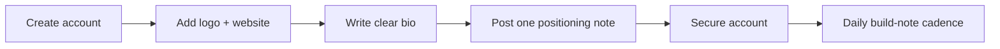

# Day 3 — Setting Up X as a Lightweight Build Signal

Date: 2026-06-19

Stage: Week 1 — Public account foundation

Status: Completed


## Context

After the website and indexing foundation were in motion, SandBase needed a simple public signal that the project was being actively built.

For an infrastructure product, X is not the place to explain the whole product. It is better used as a lightweight operating pulse:

- short build notes
- technical opinions
- founder/company presence
- conversation discovery
- early credibility when someone searches the brand

The risk was also clear: a brand-new X account can look spammy if it immediately follows many people, posts many links, or over-promotes the product.

## Goal

Create and complete the SandBase X account without triggering the feeling of a throwaway marketing account.

The goal was to make the account look real, stable, and technically focused.

## Beginner View

A new X account should not behave like a marketing bot.

For a technical product, the first job is to look real: clear bio, real website, one positioning post, and a calm posting rhythm.

The simple version:

```text
Do not chase reach on day one. Establish trust first.
```

## Visual Map



## Tools Used

| Tool | Role | How it was used |
|------|------|-----------------|
| Codex | Account setup co-pilot | Recommended profile copy, safety sequence, first-post strategy, and daily cadence |
| Browser | Live account setup | Used for profile editing, security checks, and posting with confirmation |
| X | Public build signal | Brand handle, bio, website, first positioning post |
| Markdown docs | Operating memory | Recorded copy, decisions, and what not to do on a new account |

## What We Set Up

Public account:

https://x.com/SandbaseAI

The profile was completed with:

- brand name
- profile image
- website link
- concise bio
- first positioning post
- 2FA recommendation and security review

The bio direction was kept simple:

```text
Agent infrastructure for developers building production AI agents.
```

That line is not flashy, but it gives the right audience the right signal.

## First Post Strategy

The first post was intentionally not a link dump.

For a new account, the first useful move is to state the build direction clearly:

```text
Building SandBaseAI: agent infrastructure for production AI agents.

We're focused on sandboxed runtime, tool access, model routing, and distributed compute for agent workloads.

Agents need more than model calls. They need reliable infrastructure to run, use tools, and scale.
```

This kind of post does three things:

- it tells future visitors what the company is building
- it avoids suspicious link-heavy behavior
- it creates a baseline for future technical threads

## How Codex Helped

Codex acted more like an operator than a copy generator.

It helped decide:

- not to post too many links on day one
- not to follow or interact heavily immediately after registration
- to prioritize account completion before promotion
- to keep the profile aligned with the same positioning used on the website
- to treat account safety as part of growth operations

This was important because early distribution work often fails by moving too fast in public.

## Decisions Made

### Keep the First Day Quiet

We decided not to do aggressive following, reposting, or outreach from a fresh account.

The stronger move was:

1. complete profile
2. secure account
3. publish one clean positioning post
4. let the account rest
5. return the next day with a technical build note

### One Post Per Day Is Enough

The working cadence became:

```text
1 build note per day
1-3 thoughtful replies per day
few links early on
technical language over marketing language
```

For a developer infrastructure product, consistency matters more than volume.

## What Another Founder Can Copy

For a new infrastructure product account:

1. Use a stable handle that matches the company.
2. Add a real logo and website before posting.
3. Write a bio that says who the product is for.
4. Publish one positioning post without links.
5. Avoid mass following and repeated link posts.
6. Turn one build decision per day into a short public note.

## Lesson

X is not the whole growth engine.

It is a public heartbeat.

For SandBase, the job of X is to make the company look alive, technical, and consistent when a developer checks whether the project is real.
