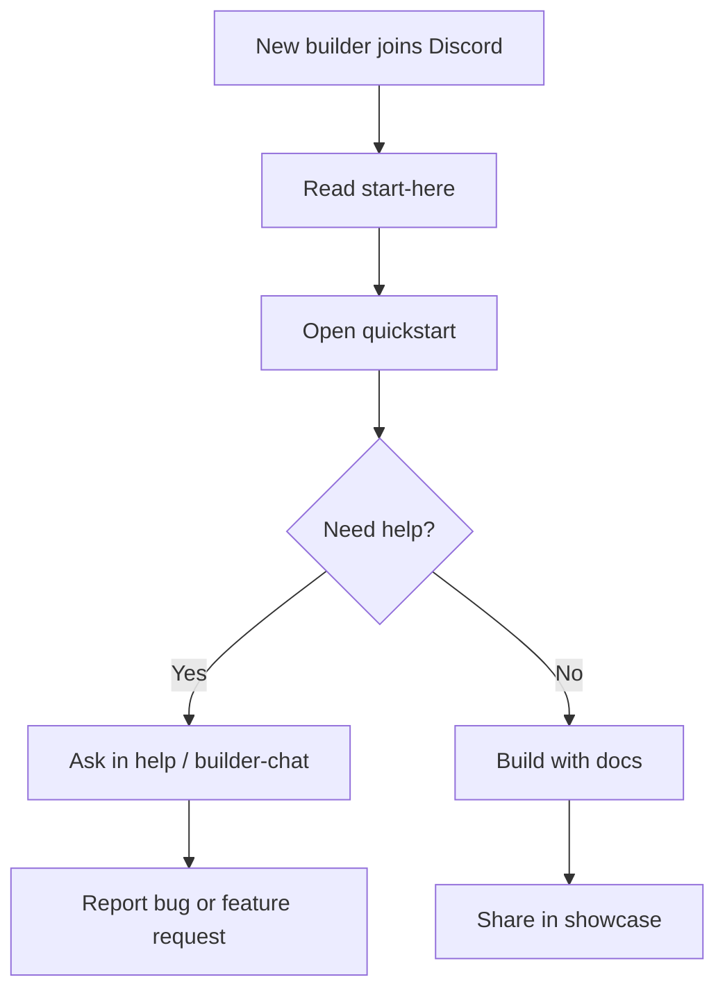

# Day 4 — Turning Discord Into a Developer Community Entry Point

Date: 2026-06-19

Stage: Week 1 — Community foundation

Status: Completed


## Context

SandBase already had a Discord server, but a Discord server is not automatically a community.

For an early infrastructure company, the first version of Discord needs to do three jobs:

1. Help new developers understand what the product is.
2. Give builders a low-friction place to ask questions and report issues.
3. Stay controlled enough that public links do not turn into spam, noise, or moderation debt.

That balance matters because SandBase is not trying to build a broad consumer AI group. It is building a focused community for people working on production AI agents, agent runtimes, sandboxed tools, model routing, and developer infrastructure.

## Goal

Review and improve the SandBase Discord setup so it becomes a real conversion and feedback entry point.

The goal was not to create a large server with many empty channels. The goal was to make a small server feel intentional:

- clear first screen
- simple navigation
- founder/team presence
- controlled permissions
- places for support and feedback
- enough safety for early public sharing

## Beginner View

Discord is not valuable because it has many channels.

It is valuable when a new builder can join and immediately understand:

- where to start
- where to ask for help
- where to report bugs
- where to follow updates

The simple version:

```text
A small clear community is better than a large empty server.
```

## Visual Map



## Tools Used

| Tool | Role | How it was used |
|------|------|-----------------|
| Codex | Ops reviewer and community architect | Inspected the server, identified gaps, proposed a lean structure, and recorded the operating decisions |
| Browser / Computer Use | Live Discord review | Used to inspect channels, roles, permissions, safety setup, and onboarding without publishing or changing settings without confirmation |
| Discord | Community entry point | Server structure, roles, permissions, announcements, and feedback channels |
| Markdown docs | Operating memory | Turned the review into an internal checklist and a public playbook |

## Starting Point

The server already had a sensible skeleton:

```text
START HERE
- welcome
- announcements
- resources

COMMUNITY
- general
- introductions

BUILDERS
- tech-talk
- dev-help
- showcase

FEEDBACK
- bug-reports
- feature-requests
```

That structure was much better than a single `general` channel. It already separated orientation, community discussion, technical building, and feedback.

The problem was that the server still felt unfinished:

- key entry channels were empty
- server profile copy was thin
- `@everyone` permissions were too broad
- roles had not yet become a real permission model
- safety defaults were too open for public distribution
- feedback channels existed, but were not yet shaped as product signal channels

## What Codex Checked

Codex reviewed four layers.

### 1. Channel Architecture

The main question was:

Can a developer join and immediately know where to go?

The answer was mostly yes, but some channel names were too generic. For an agent infrastructure platform, `general`, `resources`, and `tech-talk` do not carry enough product meaning.

Recommended naming direction:

```text
welcome -> start-here
resources -> quickstart
general -> builder-chat
tech-talk -> agent-runtime
dev-help -> ask-for-help
```

The principle was simple:

Channel names should describe the action a builder wants to take.

### 2. Roles and Permissions

The first review found that default member permissions were too permissive.

For an early developer community, this is risky because public invite links can attract spam before the team has moderation habits.

The recommended role model was:

```text
Founder / Admin
Team
Moderator
Builder
Contributor
Bot
```

The recommended default for `@everyone` was intentionally narrow:

```text
Allow:
- View channels
- Read message history
- Add reactions
- Use application commands

Restrict:
- Create invites
- Mention everyone / here
- Create private threads
- Use external apps
- Create events
- Create expressions
- Manage messages
- Manage threads
- Manage channels
- Manage roles
- Administrator
```

This makes the server feel open without making every new user a potential moderation risk.

### 3. Safety Setup

The safety review found three non-blocking but important gaps:

- server rules were not enabled
- verification level was still unrestricted
- AutoMod had not been configured

The recommended public-link baseline:

```text
Server Rules: On
Verification Level: at least verified email
AutoMod: Block Mention Spam
AutoMod: Block Suspected Spam Content
Sensitive Content Filter: enabled for new or untrusted members
2FA for moderator actions: On when moderators are added
```

We decided not to over-engineer moderation on day one.

The server only needed enough safety to support small public sharing.

### 4. Content Readiness

The biggest gap was content, not structure.

An empty Discord server makes a product feel early in the wrong way. A simple first message in the right places creates the feeling that someone is home.

Recommended first messages:

```text
#start-here
What SandBase is, who it is for, and where to go first.

#quickstart
Docs, dashboard, examples, API keys, model/tool catalog, and status.

#announcements
Official product updates only.
```

The goal was not to flood the server with content. It was to create enough context that new members do not have to guess.

## Decisions Made

### Keep the Server Small

We did not expand into dozens of channels.

For a young infrastructure product, too many empty channels create a weaker impression than a compact server with clear purpose.

The useful early surface is:

- start here
- quickstart
- announcements
- builder chat
- technical help
- feedback
- bug reports
- feature requests
- showcase

Everything else can wait.

### Treat Discord as Product Infrastructure

Discord is not just "community."

For SandBase, it is also:

- support intake
- product feedback
- early user research
- developer relations
- trust signal
- conversion path from website and social channels

That changed the review criteria. We did not ask, "Does this look like a busy community?" We asked, "Can this help a serious developer move one step closer to building with SandBase?"

### Do Not Publish or Change Settings Without Confirmation

Because Discord permissions and messages are public-facing, Codex used a confirmation boundary.

It inspected first, then proposed changes, then waited before any action that would:

- send messages
- save server settings
- change roles
- alter permissions
- create public invites

This is important when AI is used as an operations partner. The useful pattern is not full autonomy. It is supervised execution with clear checkpoints.

## Final Review

After changes, the core risk items were controlled:

- ordinary members could not manage channels, roles, or server settings
- ordinary members could not create invites
- ordinary members could not mention everyone or here
- ordinary members could not create private threads
- ordinary members had no administrator permission
- announcement-style channels were kept controlled

The server became suitable for small public sharing with early users, friends, and developer circles.

The remaining recommendations before wider distribution:

1. Enable concise server rules.
2. Raise verification level to at least verified email.
3. Enable basic AutoMod for mention spam and suspected spam.

## What Another Founder Can Copy

If you are creating a Discord community for a developer infrastructure product, start with this pattern:

```text
START HERE
- start-here
- announcements
- quickstart

BUILD
- builder-chat
- ask-for-help
- architecture / runtime / integrations
- showcase

FEEDBACK
- bug-reports
- feature-requests

INTERNAL
- team
- mod-log
- safety-alerts
```

Then apply this rule:

Do not give new members powerful permissions by default.

Let people read, react, and use commands. Give posting, links, files, threads, and advanced actions through roles.

## Lessons

The best early community does not look busy. It looks alive and controlled.

A developer joining SandBase Discord should immediately understand:

- what SandBase is
- where to start
- where to ask for help
- where to report issues
- where to share what they are building

That is enough for day one.

The community can become bigger later. First, it has to be understandable.
