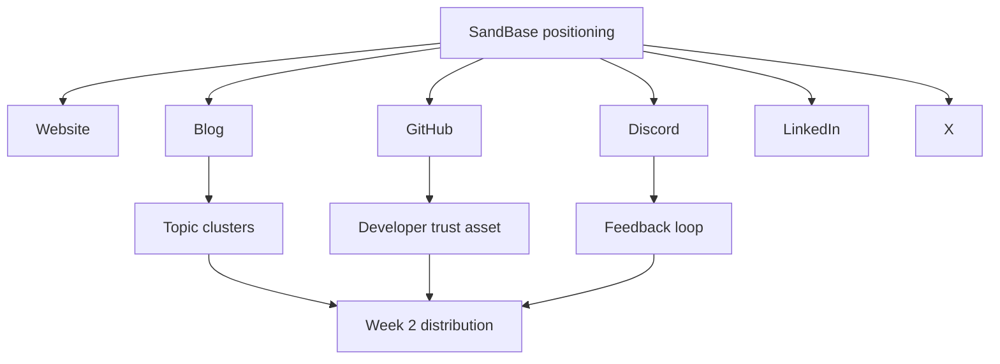

# Day 7 — Closing Week One With GitHub Trust Assets and Topic Clusters

Date: 2026-06-19

Stage: Week 1 — Foundation wrap-up

Status: Completed


## Context

By the end of the first week, SandBase had the core surfaces a developer might check:

- website
- docs
- blog
- Google Search Console
- X
- Discord
- LinkedIn
- GitHub organization

The final first-week task was to connect those surfaces into a coherent trust layer.

That meant two things:

1. Create a GitHub asset that gives developers something useful to inspect.
2. Organize the blog into topic clusters so content does not become a random pile of AI articles.

For a production AI agent infrastructure product, random AI news is a trap. It might bring short-term impressions, but it does not teach Google or developers what the company is about.

SandBase needs topic clusters that reinforce one idea:

```text
The infrastructure layer for developers building production AI agents.
```

## Goal

Close the first week by turning the public foundation into a developer-facing credibility system.

The goal was:

- create a GitHub resource repo under the SandBase org
- make the repo useful enough to be shared without feeling like an ad
- organize blog posts into clusters that support SandBase's category
- each article answers a developer question
- each article links back to a broader infrastructure theme
- each cluster supports future landing pages
- each cluster creates internal linking opportunities

## Beginner View

By the end of Week 1, the goal is not to have "many accounts."

The goal is to have a connected trust system. If a developer finds SandBase through any channel, the next channel should make the company feel more real, not less.

The simple version:

```text
Website + Blog + GitHub + Discord + LinkedIn + X should all tell the same story.
```

## Visual Map



## Tools Used

| Tool | Role | How it was used |
|------|------|-----------------|
| GitHub | Developer trust surface | Hosted the first public resource repo under the SandBase org |
| Blog content library | Source material | Existing English and Chinese posts around agents, sandboxes, models, tools, and infra |
| Codex | Editorial strategist | Grouped content into clusters and connected them to SandBase positioning |
| Markdown docs | Operating memory | Recorded cluster plan and future linking strategy |
| Google Search Console | Future validation | Used later to check which clusters start getting impressions |

## GitHub Trust Asset

Repository:

https://github.com/sandbaseai/awesome-native-agent-platforms

This repo is not product code and not a marketing dump.

It is a curated technical list around the emerging native agent platform stack:

- agent infrastructure
- agent runtimes
- sandboxed execution
- browser infrastructure
- model routing
- protocol and tool integration
- agent frameworks

It includes SandBase, but it also includes other tools in the ecosystem.

That distinction matters.

If the repo only talked about SandBase, it would look like an ad. By making it a useful ecosystem list, it can become something developers may bookmark, reference, or contribute to.

## Why GitHub Belongs in Week One

For an infrastructure product, GitHub is often checked before LinkedIn.

Even when there is no public SDK yet, a GitHub organization with a useful resource repo sends several signals:

- the company understands the developer ecosystem
- the team can produce technical artifacts
- the brand is not only a landing page
- future SDKs, examples, and demos have a natural home

This is why the repo belongs in the first-week foundation, not later as a random backlink tactic.

## Core Clusters

### 1. Agent Runtime

This cluster explains why agents need more than model calls.

Example topics:

- what an AI agent runtime is
- agent runtime vs workflow engine
- running AI agents in production
- cron-driven agents
- multi-agent systems

Why it matters:

SandBase wants developers to understand that "agent infrastructure" includes execution, scheduling, state, tools, and reliability.

### 2. Sandbox and Secure Execution

This cluster explains how agents safely use tools, files, browsers, and code.

Example topics:

- why AI agents need sandboxed execution
- secure tool use for AI agents
- browser, shell, and file access for agents
- best AI sandboxes for agent development

Why it matters:

Sandboxing is one of the clearest product categories SandBase can own.

### 3. Tools and MCP

This cluster explains how agents interact with external systems.

Example topics:

- MCP vs function calling
- connecting MCP servers to agents
- custom MCP server patterns
- tool calling infrastructure
- multi-channel agents across Slack, Discord, and WhatsApp

Why it matters:

Tool access is where many demo agents break when they move toward production.

### 4. Models and Routing

This cluster explains how production agents choose and manage models.

Example topics:

- LiteLLM vs OpenRouter
- vLLM vs SGLang
- open-weight LLMs for agents
- model gateway architecture
- cost and latency tradeoffs

Why it matters:

Developers building agent apps rarely want to bet everything on one model. Routing and abstraction become infrastructure problems.

### 5. Observability and Guardrails

This cluster explains how teams debug, monitor, and control production agents.

Example topics:

- agent observability
- logging, tracing, and debugging
- production AI agent guardrails
- memory architecture
- self-correcting agents

Why it matters:

Production users need trust and control, not just clever demos.

## Internal Linking Plan

Each article should link to:

- the SandBase homepage
- the docs or quickstart when relevant
- the Discord community
- one related article in the same cluster
- one pillar page when it exists

The future pillar content:

```text
The Agent Infrastructure Stack: Runtime, Tools, Sandboxing, Models, and Observability
```

That pillar article should become the hub all clusters link back to.

## Editorial Rules

For SandBase, a good technical article should:

- start from a real developer problem
- explain the architecture tradeoff
- compare patterns without fake certainty
- mention SandBase only when it naturally fits
- avoid sounding like a product ad
- give the reader a mental model they can reuse

This is important because developers can smell forced marketing immediately.

## What Another Founder Can Copy

Do not start a technical blog by asking for 30 titles.

Start with 4-5 clusters:

1. your product category
2. the core pain your product solves
3. the adjacent tooling ecosystem
4. comparison and decision articles
5. operational maturity topics

Then make every article point back to those clusters.

## Lesson

Content and GitHub assets only compound when they have structure.

For SandBase, the first week was not just "set up accounts."

It created a connected foundation:

- website explains the product
- blog teaches the category
- X shows the build signal
- Discord receives users and feedback
- LinkedIn creates B2B trust
- GitHub gives developers a technical artifact

That foundation is what makes Week 2 distribution worth doing.
