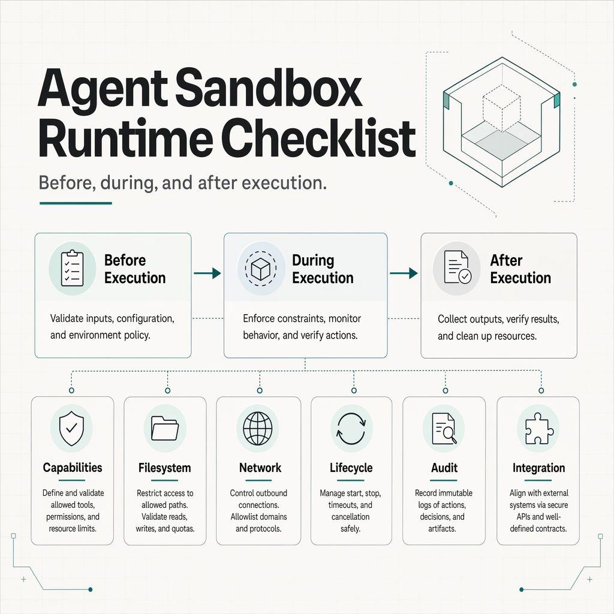

# A Practical Checklist for AI Agent Sandbox Runtimes



AI agents become harder to trust when they move from demos into production.

The model is only one part of the system. The runtime decides what the agent can actually do: read files, write files, call tools, open network connections, spawn processes, time out, recover, and leave an audit trail.

That means sandboxing should not be treated as a vague security label. For agent systems, sandboxing needs to become a set of observable runtime behaviors.

This is the checklist we are using while looking at emerging agent sandbox runtimes.

## 1. Capability Discovery Before Execution

Before an agent runs a tool, the runtime should be able to answer:

- Which sandbox levels are supported?
- Which network modes are supported?
- Which features are experimental?
- Which features are explicitly unsupported?
- Can the caller fail closed before starting execution?

This matters because unsupported behavior should not silently degrade into unsafe behavior.

For example, if a caller requests proxy-only network access but the current platform does not support it, the runtime should report that clearly before the agent starts.

## 2. Filesystem Boundaries

Agent tools often need file access. The question is not simply whether file access exists. The question is where the boundary is.

A useful runtime should make these behaviors testable:

- read-only execution
- workspace-write execution
- writes inside the declared workspace
- denied writes outside the workspace
- parent traversal handling
- symlink or junction traversal handling
- public-safe denial output

The most important case is boring but critical:

```text
Can the agent write where it is supposed to write, and fail clearly where it is not?
```

## 3. Network Boundaries

Network access is often where agent sandboxes become ambiguous.

Production agent runtimes should distinguish:

- unmanaged networking
- disabled networking
- proxy-managed networking
- unsupported proxy mode

The runtime should also avoid silent downgrade. If proxy networking is requested but unsupported, falling back to full unmanaged egress is worse than failing.

Useful evidence includes:

- direct egress fails when networking is disabled
- unsupported proxy mode fails closed
- network decisions appear in audit or trace output

## 4. Execution Lifecycle

Sandboxed execution is not only about starting a command. It is also about ending it.

The runtime should have clear answers for:

- timeout behavior
- child process cleanup
- cancellation
- completed execution retrieval
- stdout and stderr capture
- exit status
- elapsed time

Long-running or stuck tools are normal in real agent systems. The runtime should make those failures observable and recoverable.

## 5. Audit And Trace

When a tool call fails, gets denied, or times out, the operator needs to understand what happened.

A useful audit trail should include:

- execution start
- execution finish
- denied operations
- setup failures
- network decisions
- machine-readable output
- no secret leakage

For production agents, audit logs are not just compliance artifacts. They are debugging infrastructure.

## 6. Integration Surface

Agent runtimes are easier to adopt when they expose stable integration surfaces.

Useful surfaces include:

- CLI execution
- JSON output
- event streams
- RPC or service mode
- capability APIs
- setup readiness checks

The runtime should document how an agent framework should call it, not only how a human should run it manually.

## 7. Operational Fit

Finally, a runtime needs to be honest about where it works.

Good signs:

- platform differences are documented
- unsupported behavior is explicit
- setup readiness is checkable
- failure states are actionable
- conformance tests exist for claimed behavior
- threat model boundaries are written down

This is where agent infrastructure earns trust: by making runtime behavior inspectable before, during, and after tool execution.

## The Short Version

Before wiring an agent into a sandbox runtime, ask:

```text
What can this runtime prove before execution?
What can it enforce during execution?
What can it explain after execution?
```

If those three questions have clear answers, the sandbox is much closer to becoming production infrastructure.

If they do not, the sandbox may still be useful for demos, but it is not yet a runtime boundary an operator can trust.

---

SandBase is exploring these runtime questions while building agent infrastructure for production AI agents. The first local draft of this work is the `agent-sandbox-runtime-probe`: a small checklist and JSON case set for comparing agent sandbox runtimes.
