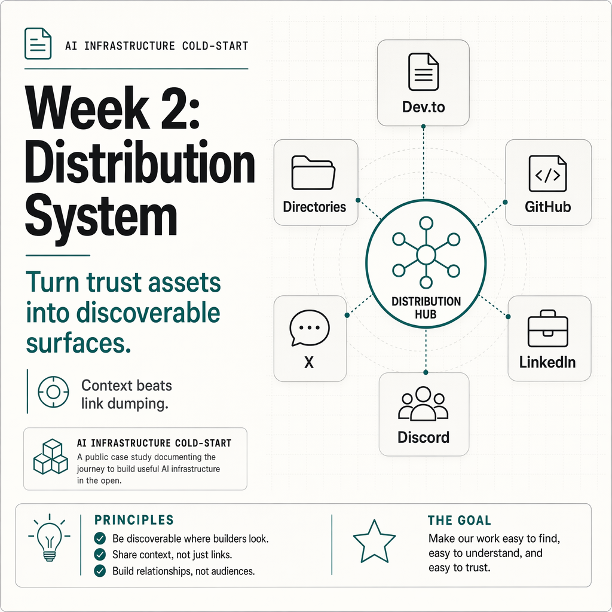
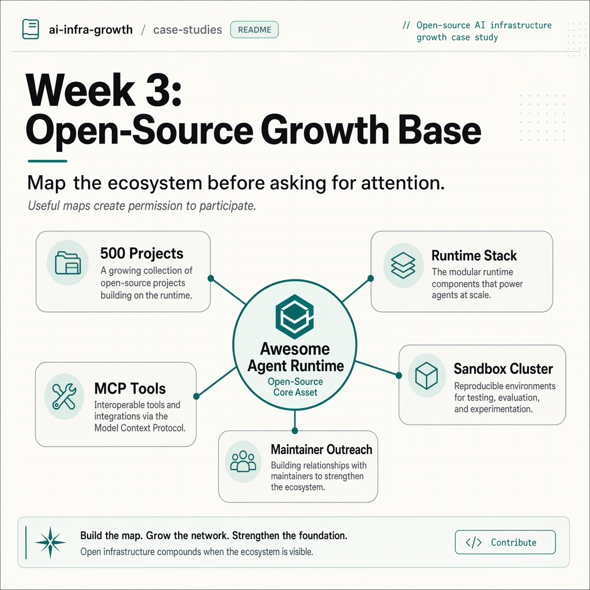
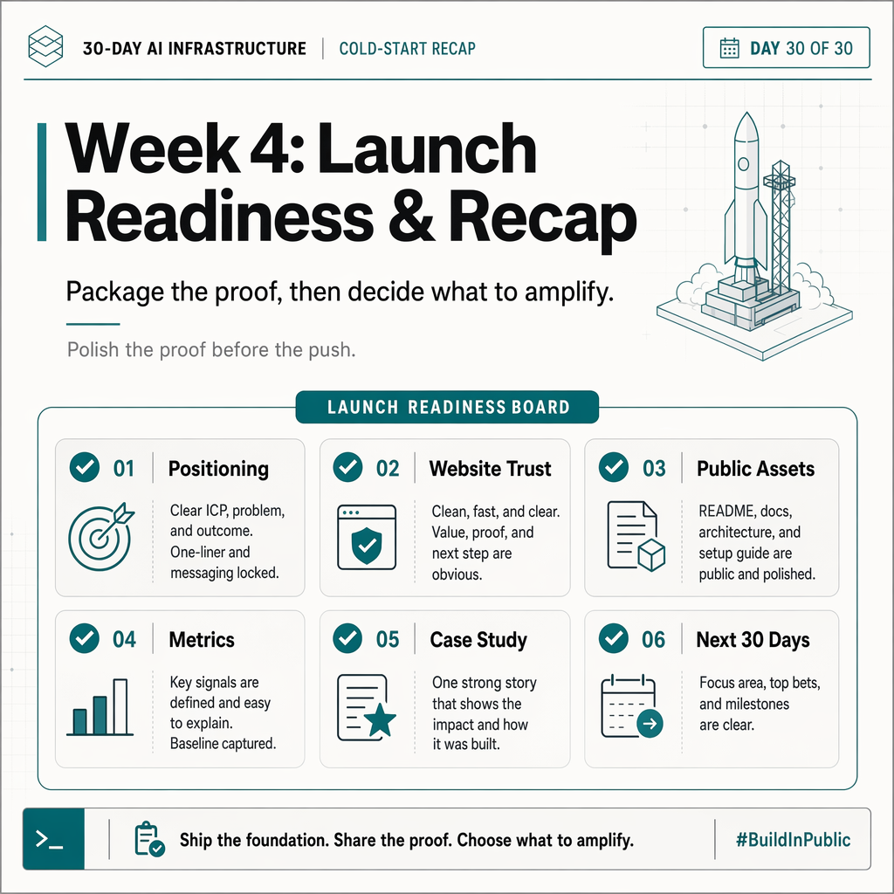
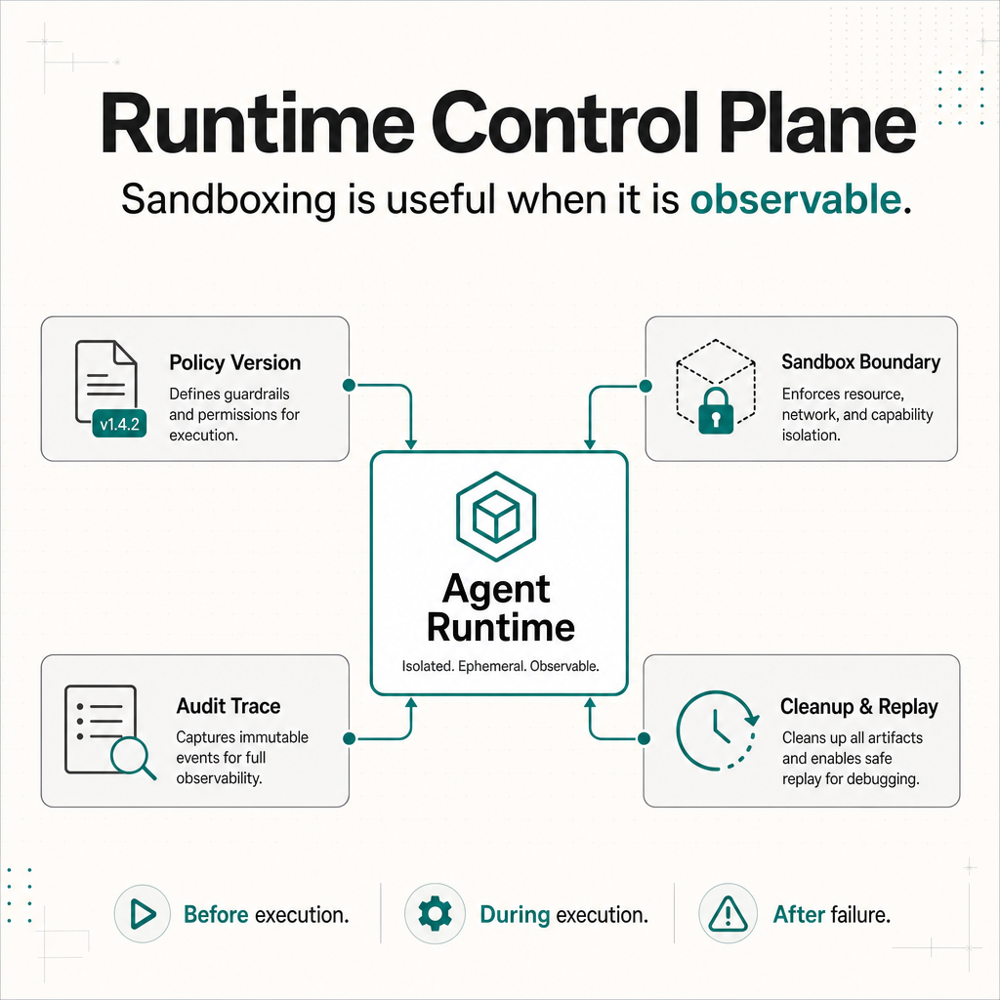
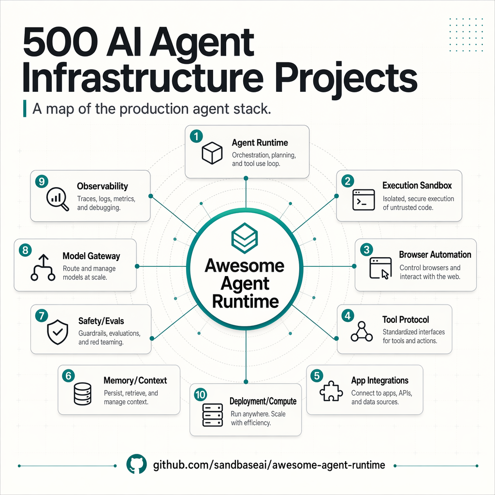

# Global AI Cold Start

> A public case study on turning SandBase.ai from an invisible early AI infrastructure product into a searchable, developer-facing trust surface.

[中文版本](README.zh-CN.md)


Most AI startups do not fail because nobody can build the demo.

They fail because almost nobody outside the team can discover it, understand it, trust it, or remember it.

This repository documents the public cold-start growth work behind [SandBase.ai](https://www.sandbase.ai/), an agent infrastructure startup for developers building production AI agents.

Cold start means starting with almost no audience, no search footprint, no trusted backlinks, and no developer community. The goal is not to go viral overnight. The goal is to build enough public proof that overseas AI builders can discover, understand, and trust the product.

In 30 days, we are turning one real AI infrastructure startup into a public, reusable growth case study.

## Current Snapshot

As of Day 20, the work has produced:

- a clearer positioning around production AI agent infrastructure
- a public website, blog, GitHub org, X, LinkedIn, Discord, and Dev.to loop
- a repeatable daily operating SOP
- technical content clusters around sandboxes, MCP, runtime policy, and tool safety
- a 500-project ecosystem map in [Awesome Agent Runtime](https://github.com/sandbaseai/awesome-agent-runtime)
- public-safe visual assets for social and README distribution

Read the concise public summary first:

- [SandBase.ai Cold-Start Progress Report](public-progress-report.md)


## What You Can Reuse

- The daily growth command center and SOP.
- A 30-day structure for SEO, content, GitHub, social, community, and backlinks.
- The decision rules for developer directories and external links.
- The operating pattern for using Codex as a growth and documentation partner.
- Public-safe content packaging for AI infrastructure companies.
- The non-spam approach to GitHub/community participation.

## Start Here

- [Daily Command Center](daily-command-center.md)
- [SandBase Daily Growth SOP](playbooks/sandbase-daily-growth-sop.md)
- [Public Promotion Plan](promotion/README.md)
- [Public Progress Report](public-progress-report.md)
- [30-Day Completion Plan](30-day-growth-diary/30-day-completion-plan.md)
- [30-Day Growth Diary](30-day-growth-diary/)
- [Manual Quality Check](30-day-growth-diary/manual-quality-check.md)
- [Week 3 plan — Open-source growth base](30-day-growth-diary/weekly-recaps/week03-open-source-growth-base.md)
- [Week 4 plan — Launch readiness and 30-day recap](30-day-growth-diary/weekly-recaps/week04-launch-readiness-and-recap.md)

Deeper playbooks:

- [Overseas Builders Outreach](overseas-builders-outreach/)
- [Hackathon Sponsorship](hackathon-sponsorship/)
- [Image prompts for social cards](assets/image-prompts/README.md)

## Who This Is For

- AI founders doing overseas growth from zero
- indie hackers building AI agents, AI infra, or devtools
- technical founders who want credible growth without spam
- builders using Codex or AI agents as an operating partner
- anyone trying to turn a real product into public trust

## What This Is

This is not a generic SEO checklist, a directory submission dump, or a pile of AI-generated marketing posts.

It is a practical growth journal for overseas AI founders, indie hackers, and technical builders who want to build public trust before asking the market for attention.

The case study is SandBase.ai, a B2B AI infrastructure product. The repeatable parts are useful for any early AI startup that needs:

- technical SEO
- crawlability
- developer-facing content
- LinkedIn company presence
- GitHub trust assets
- community interaction
- high-quality backlinks
- launch preparation
- operational lessons from using AI as a planning and documentation partner

The public version is intentionally curated. Raw operational notes are useful for learning, but the README focuses on decisions, assets, and lessons rather than a blow-by-blow activity log.

The goal is simple:

```text
Make an early AI startup look real, useful, and technically credible before asking the market for attention.
```

## Why This Exists

Most early-stage technical products have the same problem:

The product may be real, but the outside world cannot tell yet.

When a developer, investor, customer, or Google crawler looks at the company, there are usually missing signals:

- no clear positioning
- thin website content
- no public company page
- no GitHub presence
- no developer content
- no backlinks from trusted domains
- no community footprint
- no proof that the team is consistently building

This repository documents how we are solving that for SandBase, one week and one day at a time, while turning the process into a playbook other founders can reuse.

## North Star

```text
The infrastructure layer for developers building production AI agents.
```

Everything in this project is judged against that positioning.

If an action does not help developers, Google, or potential customers understand SandBase as a serious agent infrastructure platform, we do not prioritize it.

## Growth Philosophy

The core logic of this project is simple:

```text
Product first.
Foundation before scale.
Small daily actions compound.
Growth should come from the product, not sit on top of it.
```

For SandBase, growth cannot be copied from a generic AI tools playbook. The product is developer infrastructure, so the growth system also has to look like developer infrastructure:

- clear technical positioning
- crawlable and trustworthy public surfaces
- useful docs, blogs, and GitHub assets
- community channels where real questions can appear
- distribution that points to something technically useful

The goal is not to create a burst of attention.

The goal is to make the product easier to understand, easier to trust, easier to discover, and easier to return to. If we keep improving those signals day after day, quantity becomes quality over time.

## Operating Method

This project uses AI as an operating partner across research, writing, review, and documentation.

The useful pattern is:

- inspect the current public surface
- draft or revise useful assets
- package scattered work into reusable playbooks
- keep public claims specific and verifiable
- record decisions instead of only recording tasks

The workflow is:

```text
Founder sets goal
  ↓
AI helps inspect, draft, and organize
  ↓
Founder reviews public side effects
  ↓
The result becomes a clearer public asset
```

The point is not to automate judgment away. The point is to make the work more consistent, reviewable, and easier to compound.

## How to Read This

If you are an overseas AI founder, indie hacker, or solo technical builder, read it as a repeatable growth playbook.

If you are a developer, read it as a behind-the-scenes view of how an infra product builds public trust.

If you are using Codex for operations, pay attention to the confirmation boundaries: Codex can inspect, draft, and operate, but public side effects still need human approval.

## Share This

```text
Global AI Cold Start:

30 days to win overseas AI builders.

We are documenting how SandBase.ai builds the first growth layer for an AI infrastructure startup:

SEO, technical content, GitHub, X, LinkedIn, Discord, Dev.to, developer directories, backlinks, and daily lessons from building in public.
```

Short version:

```text
Global AI Cold Start is a public growth playbook for AI founders:
from zero audience to the first overseas builders, channels, content assets, backlinks, and community signals.
```

## What We Track Each Day

Each daily log is written as an operating journal, not a task list.

Every day should explain:

- the context
- the goal
- the tools used
- how Codex helped
- what was done
- what decisions were made
- what was intentionally not done
- what public assets were created
- what failed or was blocked
- what another founder could repeat

## Tools Used

| Tool | Used For |
|------|----------|
| Codex | AI coding and ops partner |
| Google Search Console | Sitemap, indexing, URL inspection |
| GitHub | Developer trust assets and public repositories |
| LinkedIn | Company page, B2B social proof, official updates |
| X | Build notes and technical conversation |
| Discord | Community entry point and user questions |
| Dev.to | Developer-facing technical writing |
| Product Hunt | Launch preparation |
| Hacker News | Technical discussion and future Show HN |
| Reddit | Community participation, not link dumping |
| AI research tools | Topic research and backlink strategy material |

The public materials are intentionally curated around reusable decisions, assets, and lessons.

## 30-Day Arc

| Week | Theme | Focus |
|------|-------|-------|
| Week 1 | Foundation | Website, SEO, blog, GitHub, X, Discord, LinkedIn, basic operating environment |
| Week 2 | Distribution | Directory submissions, Dev.to, social/community distribution, issue logging |
| Week 3 | Open-source growth base | Awesome Agent Runtime, ecosystem maps, sandbox/runtime clusters, MCP/tool protocol clusters |
| Week 4 | Launch readiness and recap | External profiles, website trust surfaces, launch assets, metrics, and final 30-day case study |

## Visual Index

| Stage | What changed | Visual |
|-------|--------------|--------|
| Week 1 | Trust foundation |  |
| Week 2 | Distribution system |  |
| Week 3 | Open-source growth base |  |
| Week 4 | Launch readiness and recap |  |
| Day 1 | SEO crawlability audit |  |
| Day 2 | Fix verification and Search Console readiness |  |
| Day 3 | X account as a daily build signal |  |
| Day 4 | Discord as a community entry point |  |
| Day 5 | LinkedIn company page as B2B trust surface |  |
| Day 6 | Blog as content infrastructure |  |
| Day 7 | Website, blog, GitHub, and community connected |  |
| Day 16 | Runtime control plane narrative |  |
| Day 18 | 500-project agent runtime map |  |
| Day 20 | Cold-start progress report |  |
| Open source | Growth flywheel |  |
| Runtime checklist | Agent sandbox compatibility checklist |  |

## Weekly Goals

### Week 1 — Accounts and Foundation

Goal:

Set up the basic operating environment so SandBase looks real, crawlable, reachable, and ready for daily operations.

Deliverables:

- website SEO baseline reviewed
- sitemap and Search Console verification handled
- blog system prepared as the technical content home
- GitHub organization and first trust asset prepared
- X account created, positioned, and secured
- Discord community structured for early builders and feedback
- LinkedIn company page created and positioned
- operating docs created for the 30-day process
- first topic clusters defined

Success criteria:

- a developer can understand what SandBase is from the website, blog, GitHub, LinkedIn, X, or Discord
- public channels use the same positioning
- no private account details are exposed in public content
- the foundation is strong enough for Week 2 distribution and daily operations

### Week 2 — Distribution and Channel Testing

Goal:

Start controlled external distribution while building the habit of daily growth actions, community interaction, and issue logging.

Deliverables:

- submit SandBase to selected credible directories only
- publish or prepare one developer-facing article outside the website
- run daily X, LinkedIn, and Discord updates
- join or reply to relevant developer discussions without link spam
- record user questions, blockers, objections, and repeated confusions
- improve GitHub resource repo quality based on feedback
- prepare Product Hunt / Hacker News assets without launching too early

Success criteria:

- 5-10 credible external mentions, links, or profile pages started
- no low-quality paid links or spam submissions
- at least one asset is genuinely useful to developers beyond SandBase promotion
- every day produces at least one recorded learning, question, or content idea
- social/community actions create conversation, not just links

### Week 3 — Open-Source Growth Base

Goal:

Turn SandBase's open-source work into the main trust and distribution engine.

Deliverables:

- prepare `awesome-agent-runtime` for external contributors
- announce the 500-project agent infrastructure map
- publish or prepare an execution sandbox content cluster
- publish or prepare an MCP/tool protocol content cluster
- prepare maintainer outreach drafts and interaction rules
- create generated PNG assets for social distribution
- keep public posting behind human confirmation

Success criteria:

- the open-source entry project is ready for community submissions
- Day 18-20 assets are prepared with clear publication checklists
- maintainer interactions are specific and non-spammy
- the repo and social assets explain SandBase's agent infrastructure positioning without overclaiming

### Week 4 — Launch Readiness And 30-Day Recap

Goal:

Close the first cold-start cycle and make the public surfaces ready for the next phase.

Deliverables:

- clean up external profiles and backlink surfaces
- review SandBase.ai trust surfaces, footer links, docs, blog, status page, and social links
- prepare Product Hunt or launch-surface assets without forcing launch
- start the community submission loop for open-source projects
- collect metrics, lessons, questions, and channel decisions
- draft or publish the final 30-day case study
- define the next 30-day theme: from public trust to developer adoption

Success criteria:

- website, GitHub, X, LinkedIn, DEV.to, Discord, and external profiles tell one consistent story
- launch assets are realistic and ready for a go/no-go decision
- metrics are recorded without inflated claims
- the final recap is useful to another founder or builder
- the next 30-day operating theme is clear

## Series Structure

```text
global-ai-cold-start
├── 30-day-growth-diary/          # SEO, content, social, community, backlinks
├── overseas-builders-outreach/   # builder outreach, customer discovery, partnerships
├── hackathon-sponsorship/        # hackathon support and developer event sponsorship
├── playbooks/                    # reusable operating playbooks
├── assets/                       # visuals and generated images
└── scripts/                      # content and image generation helpers
```

If the first part explains how to make an AI infra startup discoverable and trustworthy, the second part explains how to actively reach overseas builders, partners, and commercial opportunities.

## Daily Logs

### Week 1 — Accounts and Foundation

- [Day 1 — SEO audit and making the site crawlable](30-day-growth-diary/days/day01-seo-audit.md)
- [Day 2 — Verification is a growth step, not a cleanup step](30-day-growth-diary/days/day02-seo-fix-verification.md)
- [Day 3 — Setting up X as a lightweight build signal](30-day-growth-diary/days/day03-x-brand-account-foundation.md)
- [Day 4 — Turning Discord into a developer community entry point](30-day-growth-diary/days/day04-discord-community-foundation.md)
- [Day 5 — Creating the LinkedIn company page as a B2B trust surface](30-day-growth-diary/days/day05-linkedin-company-page.md)
- [Day 6 — Building the blog as a technical content engine](30-day-growth-diary/days/day06-building-the-blog-system.md)
- [Day 7 — Closing week one with GitHub trust assets and topic clusters](30-day-growth-diary/days/day07-first-content-clusters.md)
- [Week 1 recap — Building the trust foundation before distribution](30-day-growth-diary/weekly-recaps/week01-foundation-recap.md)

### Week 2 — Distribution and Daily Operations

- [Day 8 — Directory and community distribution](30-day-growth-diary/days/day08-directory-and-community-distribution.md)
- [Day 9 — Developer directory setup](30-day-growth-diary/days/day09-developer-directory-setup.md)
- [Day 10 — GitHub trust asset improvement](30-day-growth-diary/days/day10-github-trust-asset-improvement.md)
- [Day 11 — Off-site technical article](30-day-growth-diary/days/day11-offsite-technical-article.md)
- [Day 12 — Community participation without link spam](30-day-growth-diary/days/day12-community-participation.md)
- [Day 13 — Daily social operation loop](30-day-growth-diary/days/day13-daily-social-operation.md)
- [Day 14 — Week two review](30-day-growth-diary/days/day14-week-two-review.md)
- [Week 2 plan — Distribution and daily operations](30-day-growth-diary/weekly-recaps/week02-distribution-plan.md)

### Week 3 — Open-Source Growth Base

- [Day 15 — Open-source opportunity sourcing](30-day-growth-diary/days/day15-open-source-opportunity-sourcing.md)
- [Day 16 — Runtime control plane interactions](30-day-growth-diary/days/day16-runtime-control-plane-interactions.md)
- [Day 17 — GitHub project readiness](30-day-growth-diary/days/day17-github-project-readiness.md)
- [Day 18 — 500-project announcement](30-day-growth-diary/days/day18-500-project-announcement.md)
- [Day 19 — Execution sandbox cluster](30-day-growth-diary/days/day19-execution-sandbox-cluster.md)
- [Day 20 — MCP and tool protocol cluster](30-day-growth-diary/days/day20-mcp-and-tool-protocol-cluster.md)
- [Week 3 plan — Open-source growth base](30-day-growth-diary/weekly-recaps/week03-open-source-growth-base.md)

### Week 4 — Planned Launch Readiness And Recap

- [Day 21 — Long-form article](30-day-growth-diary/days/day21-long-form-article.md)
- [Day 22 — LinkedIn B2B narrative](30-day-growth-diary/days/day22-linkedin-b2b-narrative.md)
- [Day 23 — Directory and profile cleanup](30-day-growth-diary/days/day23-directory-and-profile-cleanup.md)
- [Day 24 — Community interaction day](30-day-growth-diary/days/day24-community-interaction-day.md)
- [Day 25 — Website and trust surface review](30-day-growth-diary/days/day25-website-and-trust-surface-review.md)
- [Day 26 — Product Hunt and launch surface prep](30-day-growth-diary/days/day26-product-hunt-and-launch-surface-prep.md)
- [Day 27 — Open-source community push](30-day-growth-diary/days/day27-open-source-community-push.md)
- [Day 28 — Metrics and learnings](30-day-growth-diary/days/day28-metrics-and-learnings.md)
- [Day 29 — Final case study draft](30-day-growth-diary/days/day29-final-case-study-draft.md)
- [Day 30 — Publish recap and set next 30 days](30-day-growth-diary/days/day30-publish-recap-and-set-next-30-days.md)
- [Week 4 plan — Launch readiness and 30-day recap](30-day-growth-diary/weekly-recaps/week04-launch-readiness-and-recap.md)

## Public Assets Created So Far

- Website: https://www.sandbase.ai
- Blog: https://www.sandbase.ai/blog/
- LinkedIn company page: https://www.linkedin.com/company/sandbaseai/
- GitHub org: https://github.com/sandbaseai
- GitHub ecosystem map: https://github.com/sandbaseai/awesome-agent-runtime
- GitHub resource repo: https://github.com/sandbaseai/awesome-native-agent-platforms
- X: https://x.com/SandbaseAI
- Discord: https://discord.com/invite/P6B5Y4e8TX

## Publishing Note

This repository is curated for public learning and promotion. The README and progress report focus on reusable decisions, assets, and lessons rather than raw operating logs.

## Principles

1. Build real assets before asking for attention.
2. Prefer technical depth over generic AI content.
3. Treat backlinks as trust assets, not numbers.
4. Do not buy links.
5. Do not mass-submit low-quality directories.
6. Do not turn every article into an ad.
7. Participate in communities before linking.
8. Record decisions, not just tasks.
9. Protect private account details.
10. Use AI assistance with confirmation boundaries.

## Current Status

Day 20 status:

- Public trust foundation is live across website, blog, GitHub, X, LinkedIn, Discord, and Dev.to.
- Week 3 shifted the strongest growth wedge toward open-source ecosystem assets.
- `awesome-agent-runtime` now maps 500 production-agent infrastructure projects.
- Execution sandbox and MCP/tool protocol content clusters are prepared.
- Public actions are recorded with confirmation boundaries and safety notes.
- The next milestone is a polished 30-day recap and a cleaner launch-readiness package.

## License

This repository is shared as an operating case study. Public strategy notes and playbooks may be reused with attribution. Private product code, credentials, account details, and internal business data are not included.
