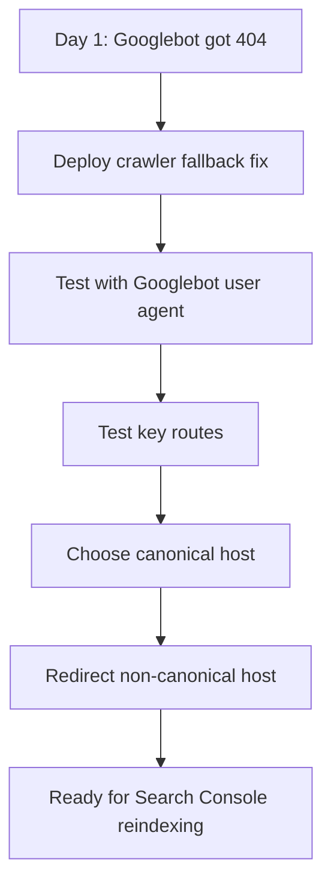

# Day 2 — Verification Is a Growth Step, Not a Cleanup Step

Date: 2026-06-19

Stage: Week 1 — Foundation

Status: Completed

## Context

Day 1 uncovered a serious crawlability issue:

```text
Normal users received 200.
Googlebot received 404.
```

That meant SandBase could look fine in a browser while still being broken for search engines and social preview crawlers.

On Day 2, the job was not to add new pages or write new articles.

The job was to verify that the foundation was actually fixed.

This is an easy step to skip. Many teams patch the obvious bug and immediately move on to content. But SEO infrastructure has to be verified from the crawler's point of view, not the developer's point of view.

## Goal

Close the Day 1 P0 issue and make the site more canonical:

1. Verify that Googlebot no longer receives `404`.
2. Confirm core routes return valid responses for crawlers.
3. Ensure the site has one canonical host.
4. Check that homepage metadata is strong enough for indexing and sharing.
5. Define the exact moment when it is safe to request indexing in Search Console.

## Beginner View

Fixing a bug is not the same as proving it is fixed.

Day 2 was about acting like Google, not like a developer. We tested the site with crawler user agents, checked the canonical host, and only then treated the SEO foundation as ready.

The simple version:

```text
Do not ask Google to index a page until you have tested what Googlebot receives.
```

## Visual Map



## Tools Used

| Tool | Role | How it was used |
|------|------|-----------------|
| Codex | Verification partner | Turned the Day 1 bug into a concrete verification checklist |
| curl | Bot simulation | Tested Googlebot, Bingbot, and social crawler user agents |
| nginx config | Host and prerender behavior | Added canonical host redirects and fixed crawler fallback behavior |
| Test environment | Safe deploy target | Verified bot responses before relying on production |
| Google Search Console | Indexing workflow | Reserved for reindexing only after crawler status was fixed |

## How Codex Helped

Codex helped keep the team from treating the fix as done too early.

The workflow was:

```text
Find crawler 404
  ↓
Fix nginx/prerender behavior
  ↓
Deploy to test
  ↓
Retest with crawler user agents
  ↓
Check canonical host behavior
  ↓
Only then request indexing
```

Codex also caught a second-order issue during verification: the nginx route fix interacted with `location` priority. The first fix was conceptually right, but route matching still needed to be adjusted so `/prerender/` was handled before a broader HTML rule.

That is why verification matters.

It does not just prove a fix worked. It often reveals the next hidden bug.

## What We Did

### 1. Verified crawler responses in the test environment

The fix was deployed to a test environment first.

The key routes were checked with crawler user agents:

- `/`
- `/models`
- `/agents`
- `/pricing`

Results:

| User agent | Result |
|------------|--------|
| Googlebot | 200 |
| Bingbot | 200 |
| Facebook external hit | 200 |

This confirmed that the P0 failure from Day 1 was fixed in test.

### 2. Fixed host canonicalization

Day 1 also showed that multiple host and scheme variants could return `200`.

That is not ideal:

```text
http://sandbase.ai/
http://www.sandbase.ai/
https://sandbase.ai/
https://www.sandbase.ai/
```

If all variants behave like separate pages, search engines may see duplicate versions of the homepage.

The canonical target should be:

```text
https://www.sandbase.ai/
```

So the nginx configuration was updated to redirect the naked domain to the `www` host:

```nginx
if ($host = "sandbase.ai") {
    return 301 https://www.sandbase.ai$request_uri;
}
```

The goal was simple:

```text
One canonical homepage. One sitemap host. One source of truth.
```

### 3. Rechecked metadata

After fixing crawler access, we checked whether the site had the basic metadata needed for search and social sharing.

The homepage had:

- unique title
- description
- keywords
- canonical URL
- Open Graph metadata
- Twitter Card metadata
- structured data
- favicon
- noscript fallback

Core pages also used route-specific SEO metadata.

This meant Day 2 did not need to become a metadata rewrite day. The biggest issue had been server behavior, not missing title tags.

### 4. Defined the production verification commands

The production verification checklist was written as commands that could be reused after deploy:

```bash
GBOT="Mozilla/5.0 (compatible; Googlebot/2.1; +http://www.google.com/bot.html)"

for u in \
  https://www.sandbase.ai/ \
  https://www.sandbase.ai/models \
  https://www.sandbase.ai/pricing
do
  curl -sS -A "$GBOT" -o /dev/null -w "$u -> %{http_code}\n" "$u"
done
```

And for host convergence:

```bash
curl -sS -o /dev/null -w "naked -> %{http_code} -> %{redirect_url}\n" https://sandbase.ai/
```

The point was to make verification repeatable.

If a future deployment breaks crawler behavior again, the team should not have to rediscover the test method.

## Decisions

### We did not request indexing before verification

Search Console is not a magic button.

If Googlebot still sees `404`, requesting indexing only asks Google to re-check a broken page.

The correct sequence is:

1. Fix response behavior
2. Verify with crawler user agent
3. Verify production
4. Request indexing

### We did not over-optimize metadata

It is tempting to rewrite every title and description during an SEO audit.

But Day 2 showed the metadata foundation was already acceptable. The higher-leverage work was response status, redirects, and crawler access.

### We chose one canonical host

For SandBase, the canonical host is:

```text
https://www.sandbase.ai/
```

That matches:

- homepage canonical
- robots sitemap reference
- public website URL
- Search Console expectations

## Output

Engineering output:

- crawler `404` fixed in test
- canonical host redirect configured
- crawler verification commands documented
- metadata baseline confirmed

Operational output:

- clear handoff for production verification
- Search Console reindexing rule: only after crawler `200`

## What We Learned

### 1. Verification is part of growth

SEO is not just content and keywords.

For a technical product, SEO includes deploy behavior, server routing, redirects, prerendering, and crawler response status.

### 2. Fixes can create new routing interactions

The initial crawler fallback fix needed a follow-up adjustment because nginx `location` priority affected which rule handled rewritten HTML routes.

This is why verification should happen in a test environment before declaring victory.

### 3. Canonical host decisions should happen early

If the site starts collecting links across multiple host variants, cleanup gets harder later.

Pick the canonical host early and redirect everything else.

### 4. Search Console should be used after the site is ready

Search Console is best used as a validation and indexing tool, not as a workaround for technical problems.

## Replicable Playbook

For any new B2B SaaS or developer tool website:

1. Pick a canonical host.
2. Make every other host/scheme redirect to it.
3. Test the homepage with Googlebot user agent.
4. Test key product routes with Googlebot user agent.
5. Test social crawler user agents if LinkedIn/X sharing matters.
6. Confirm sitemap remains reachable.
7. Confirm canonical metadata matches the redirect target.

## Share Copy

```text
Day 2 of building SandBase.ai in public:

We treated verification as growth work.

The fix was not done when the code changed.
It was done when Googlebot received 200, key routes worked, and the canonical host was clear.

SEO starts with proof.
```
8. Only then request indexing in Search Console.

## Next Actions

Move from crawlability to information architecture.

Day 3 should answer:

```text
If Google and users can now see the site, are the right pages actually there?
```

That means auditing core pages:

- homepage
- docs
- blog
- pricing/contact
- use case pages
- community page
