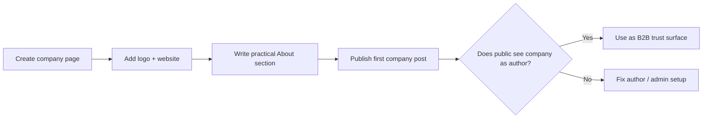

# Day 5 — Creating the LinkedIn Company Page Without Exposing the Wrong Account

Date: 2026-06-19

Stage: Week 1 — Public trust foundation

Status: Completed

## Context

LinkedIn matters differently from X.

X is a lightweight build signal. LinkedIn is a B2B trust surface.

When a potential customer, investor, partner, or candidate searches SandBase, a real company page helps answer a basic question:

Is this a serious company or just a website?

For SandBase, LinkedIn also had a privacy constraint. The founder wanted to build a company presence without visibly tying a separate personal account to the brand.

That made the setup more than a form-fill task.

## Goal

Create a public LinkedIn company page for SandBaseAI, complete the page details, publish a first company post, and make sure ordinary visitors see the company as the author rather than a private personal account.

## Beginner View

LinkedIn is not just another place to post.

For a B2B infrastructure company, it answers a basic trust question:

```text
Is this a real company with a public identity?
```

That is why the company page, author visibility, and admin privacy all mattered.

## Visual Map



## Tools Used

| Tool | Role | How it was used |
|------|------|-----------------|
| Codex | Browser co-pilot and privacy guard | Drafted company copy, operated page setup, checked public/private visibility implications |
| Browser | Live LinkedIn setup | Created and edited the company page with confirmation before publishing |
| LinkedIn | B2B trust surface | Company page, About section, first official post |
| Markdown docs | Operating memory | Recorded copy, admin decisions, privacy notes, and follow-up tasks |

## What We Created

Public company page:

https://www.linkedin.com/company/sandbaseai/

The page was completed with:

- logo
- tagline
- website
- industry
- company size
- company type
- About section
- message button
- website CTA

The company positioning stayed consistent with the website:

```text
SandBaseAI is an agent infrastructure platform for developers building production AI agents.
```

## First Company Post

The first post introduced the company without over-selling it:

```text
Today we set up SandBaseAI's LinkedIn page.

We're building agent infrastructure for developers working on production AI agents: sandboxed runtime, tool access, model routing, and distributed compute for agent workloads.

The goal is simple: help agents move from demos to reliable systems that can run, use tools, and scale with clearer boundaries.

More soon.
```

The post was published as the company page, not as a personal profile.

That detail matters. The public surface should say "SandBaseAI," while LinkedIn's internal admin system can still know which account performed the action.

## Privacy and Admin Decision

There was an important admin question:

Should a separate operating LinkedIn account be added as page admin?

The operating account followed the page, but LinkedIn search returned several ambiguous same-name profiles when adding admins.

Decision:

Do not add an ambiguous account.

Reason:

Adding the wrong person as a company page admin is a real permission mistake. We waited rather than guessing.

The broader rule:

```text
Public brand surface first.
Admin convenience second.
No guessing on identity or permissions.
```

## How Codex Helped

Codex helped in four ways:

1. Drafted a restrained company description.
2. Checked whether public viewers would see the company or personal account as post author.
3. Paused before public side effects like publishing and admin changes.
4. Turned the privacy decision into an operating rule for future account work.

This is a good example of why AI ops work needs confirmation boundaries.

The task was not hard because of writing. It was sensitive because of identity, privacy, and public brand ownership.

## What Another Founder Can Copy

For a B2B infrastructure product:

1. Create the company page early.
2. Use the same positioning as the website.
3. Publish one calm company post.
4. Avoid hype claims before proof exists.
5. Keep personal account privacy in mind.
6. Do not add admins unless the exact profile is unambiguous.

## Lesson

LinkedIn is not just another social account.

It is a credibility object.

For SandBase, the page helped establish that the company has a public identity beyond the website, while still respecting the founder's account privacy constraints.

## Share Copy

```text
Day 5 of building SandBase.ai in public:

We created the LinkedIn company page.

Not for vanity.
For B2B trust.

When someone searches the company, they should see a real infrastructure brand, not just a landing page.
```
