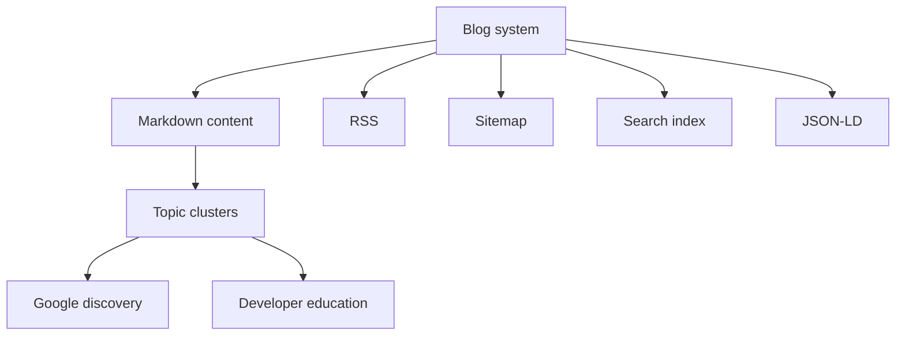

# Day 6 — Building the Blog as a Technical Content Engine

Date: 2026-06-18

Stage: Week 1 — Content infrastructure

Status: Completed

## Context

After the homepage, docs, social accounts, and community entry points existed, SandBase needed a place for serious technical content.

For an AI infrastructure company, the blog is not a news feed.

It is the long-term surface where Google, developers, and potential customers can understand the technical category:

- agent infrastructure
- AI agent runtime
- sandboxed execution
- tool calling
- MCP integrations
- model routing
- observability
- production agent patterns

That meant the blog had to be treated as infrastructure, not just a folder of Markdown files.

## Goal

Build a blog system that can support SEO, bilingual content, topic clusters, and future technical distribution.

The goal was not simply to publish a few posts. The goal was to create a content engine that can scale over the full 30-day growth plan.

## Beginner View

A blog is not just a place to publish articles.

For a technical product, the blog is the place where you teach the market what category you are building in.

The simple version:

```text
The website explains the product.
The blog explains the problem space.
```

## Visual Map



## Tools Used

| Tool | Role | How it was used |
|------|------|-----------------|
| Astro | Blog framework | Static blog, routing, Markdown content, build output |
| Tailwind | Styling | Lightweight layout and readable technical pages |
| Astro sitemap | SEO infrastructure | Sitemap generation with custom canonical handling |
| Astro RSS | Distribution | RSS endpoints for blog content |
| Codex | Code reviewer and ops recorder | Inspected the blog structure and turned the implementation into a public growth log |
| Markdown content | Editorial system | English and Chinese posts organized by locale |

## What Was Built

Local blog app:

```text
sandbase-monorepo/sandbase-blog
```

Public route:

```text
https://www.sandbase.ai/blog/
```

The blog includes:

- Astro 5
- Tailwind
- Markdown content collections
- English and Chinese locales
- RSS
- search index
- archive pages
- tag pages
- category pages
- 404 page
- Dockerfile
- nginx config
- tests

This matters because a technical growth program needs repeatable publishing, not one-off pages.

## SEO Details

The blog has several SEO-oriented pieces that are easy to overlook.

### 1. Canonical URL Handling

The Astro app uses:

```text
site: https://www.sandbase.ai
base: /blog
defaultLocale: en
locales: en, zh-CN
```

The implementation includes custom sitemap rewriting so English content is served at `/blog/...` instead of producing redirecting `/blog/en/...` URLs.

That prevents search engines from seeing duplicate or redirecting default-locale URLs.

### 2. Sitemap Filtering

The sitemap excludes thin or duplicate listing pages:

- tag pages
- category pages
- archive page
- numeric pagination pages

Those pages can stay crawlable with `noindex, follow`, but they should not compete with article pages in the sitemap.

This is the right tradeoff for a blog where articles are the primary SEO assets.

### 3. Accurate Last Modified Dates

The sitemap builds a map from content frontmatter so article URLs can emit accurate `lastmod` values.

That gives search engines a cleaner recrawl signal when content is updated.

### 4. Structured Data

The blog has JSON-LD helpers for:

- `BlogPosting`
- `BreadcrumbList`
- publisher organization
- author organization
- article language
- publish and modified dates

This is not magic SEO, but it helps make article pages machine-readable and consistent.

## Content Model

The content collection schema requires:

```text
title
slug
date
updatedDate
author
tags
category
description
image
imageAlt
draft
language
```

That schema is useful because it forces every post to have enough metadata to become a real search result, not just a raw Markdown page.

## Existing Content Base

The blog already contains English and Chinese technical content around:

- AI sandboxes
- MCP vs function calling
- agent observability
- agent guardrails
- model gateways
- open-source agent frameworks
- inference engines
- agent memory
- multi-agent systems
- production AI agent architecture

This is important for SandBase's positioning.

The blog is not trying to become a generic AI news site. It is building topical depth around the infrastructure layer below production AI agents.

## How Codex Helped

Codex's role here was not to invent the blog from scratch during the public log.

The blog already existed in the monorepo. Codex inspected it and extracted the growth story:

- what the system does
- why the architecture matters for SEO
- which parts support the 30-day plan
- what future founders can copy
- how it connects to the north star

That turns an engineering artifact into a public operating lesson.

## What Another Founder Can Copy

If you are building a technical product blog:

1. Use a real static site system, not ad hoc HTML pages.
2. Add RSS early.
3. Add sitemap support early.
4. Do not put every listing page in the sitemap.
5. Use structured frontmatter for every post.
6. Add JSON-LD for article pages.
7. Keep canonical routes clean.
8. Organize posts around topic clusters, not random news.

## Lesson

The blog is not content decoration.

It is technical distribution infrastructure.

For SandBase, the blog gives the company a place to build authority around agent infrastructure before paid acquisition, launch spikes, or directory backlinks matter.

## Share Copy

```text
Day 6 of building SandBase.ai in public:

We treated the blog as infrastructure.

Not just posts.

RSS, sitemap, bilingual content, canonical handling, JSON-LD, topic clusters.

For an infra product, content needs a system before it can compound.
```
