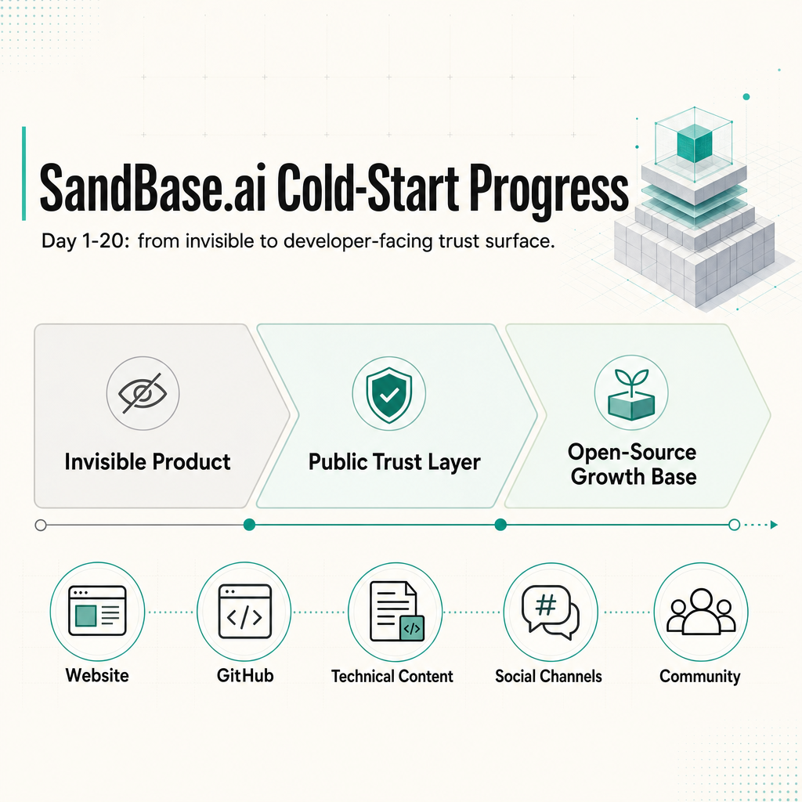
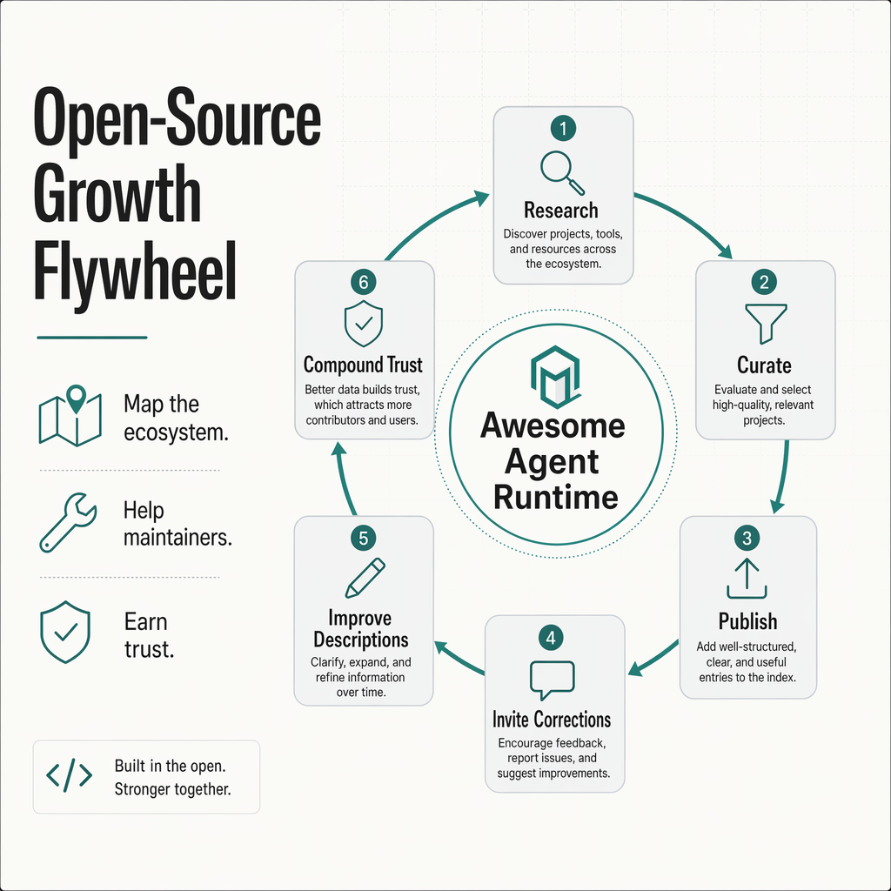

# SandBase.ai Cold-Start Progress Report

Public-safe summary for sharing the first 20 days of the SandBase.ai overseas growth work.



## Executive Summary

SandBase.ai started this cycle with the classic early infrastructure-company problem: the product direction was real, but the public proof around it was still thin.

The first 20 days were not about forcing a launch. They were about building the trust layer an overseas developer needs before paying attention:

- a clearer positioning around production AI agent infrastructure
- crawlable website and content surfaces
- public social channels that tell the same story
- a developer-facing GitHub organization
- reusable open-source assets
- technical content around sandboxed execution, MCP, runtime policy, and tool safety
- a lightweight community and external-link system

The strongest public asset so far is [Awesome Agent Runtime](https://github.com/sandbaseai/awesome-agent-runtime), a 500-project map of the production AI agent infrastructure ecosystem.

## What Changed

### 1. Positioning became sharper

The working positioning is:

```text
Agent infrastructure for developers building production AI agents.
```

The content now consistently points to a few concrete themes:

- sandboxed runtime
- safe tool execution
- model and tool routing
- runtime policy
- audit trails
- production reliability

This matters because "AI agent platform" is too broad. The public story needs to make SandBase easier to classify in a developer's head.

### 2. The public trust layer is live

The first trust layer now spans:

- website and blog
- GitHub organization
- X account
- LinkedIn company page
- Discord community
- Dev.to technical articles
- developer directories and profile pages
- public status/trust surfaces

The goal was not to make every channel large. The goal was to make each public surface coherent enough that a developer can land anywhere and still understand what SandBase is building.

### 3. The open-source angle became the strongest growth wedge



The clearest traction path is not generic social posting. It is ecosystem mapping and technical participation.

The work produced:

- [Awesome Agent Runtime](https://github.com/sandbaseai/awesome-agent-runtime)
- a 500-project landscape across 10 production-agent infrastructure categories
- contribution templates and maintainer outreach notes
- discussion around browser MCP surfaces and hosted runtime boundaries
- content clusters around execution sandboxing and MCP/tool protocols

This gives SandBase a reason to participate in the agent infrastructure conversation without turning every interaction into an ad.

### 4. The content system moved from daily notes to reusable assets

The raw daily logs are still useful internally, but the public layer now needs stronger packaging.

Reusable assets created so far include:

- technical article drafts
- social post packs
- generated PNG visuals
- backlink candidate lists
- directory submission notes
- daily operation SOP
- launch readiness checklist

The next step is to turn the best of these into polished public articles and GitHub README sections.

## Public-Safe Highlights

| Area | Result |
| --- | --- |
| Positioning | Production AI agent infrastructure, not generic AI tools |
| SEO / website | Crawlability and basic trust surfaces reviewed |
| Social | X, LinkedIn, Discord, Dev.to operating loop established |
| GitHub | SandBase org and public resource repos created |
| Open source | Awesome Agent Runtime expanded to 500 projects |
| Content | Runtime, sandbox, MCP, and tool-policy clusters drafted |
| Backlinks | External profiles and contextual GitHub/community interactions started |
| Safety | Public actions kept behind human confirmation; private account data excluded |

## What We Should Promote

Promote these first:

1. [Awesome Agent Runtime](https://github.com/sandbaseai/awesome-agent-runtime)
2. the 500-project production agent infrastructure map
3. execution sandbox / runtime-policy articles
4. MCP preflight and tool-surface audit learnings
5. the 30-day cold-start playbook as a founder/operator story

Avoid promoting these as the main story:

- raw daily task logs
- internal browser-operation details
- account setup minutiae
- directory submission bookkeeping
- unverified metrics

## Publishing Note

This report is the public version of the work. It focuses on reusable decisions, assets, and lessons rather than raw operating logs.

## Next Public Narrative

Recommended public framing:

```text
We spent the first 20 days turning SandBase.ai from a mostly invisible AI infrastructure product into a public, searchable, developer-facing trust surface.

The biggest output is Awesome Agent Runtime: a curated 500-project map of the production AI agent infrastructure stack, covering runtimes, sandboxes, browser automation, MCP/tool protocols, memory, safety/evals, observability, model gateways, and deployment.
```

## Next Work

- Polish the final 30-day case study.
- Add better visuals to the open-source repos.
- Keep README pages concise and public-safe.
- Convert the strongest daily lessons into 3-5 long-form articles.
- Continue GitHub/community participation only where the comment is technically useful.
