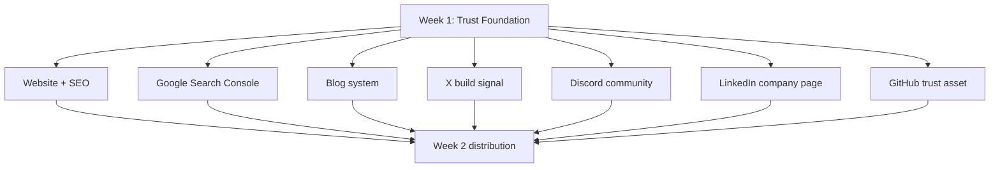

# Week 1 Recap — Building the Trust Foundation Before Distribution

Date: 2026-06-19


## The Short Version

Before asking people to visit SandBase, we needed SandBase to look real when they arrived.

So Week 1 was not about growth hacks.

It was about the trust foundation every early technical product needs:

- Can Google crawl the site?
- Does the website explain the product?
- Is there a technical blog?
- Is there a public company page?
- Is there a developer community?
- Is there a GitHub presence?
- Is there a daily build signal?
- Are all channels saying the same thing?

If the answer is no, distribution is premature.

## Visual Map



## What We Built

| Day | Focus | Output |
|-----|-------|--------|
| Day 1 | SEO crawlability | Found and fixed a crawler-facing 404 risk |
| Day 2 | Verification | Confirmed crawler response, canonical host, and Search Console readiness |
| Day 3 | X | Created the public build signal |
| Day 4 | Discord | Turned the server into a clear builder community entry point |
| Day 5 | LinkedIn | Created the B2B company trust surface |
| Day 6 | Blog | Documented the technical content engine |
| Day 7 | GitHub + clusters | Created a developer trust asset and topic cluster map |

The pattern was deliberate:

```text
Fix crawlability
  ↓
Verify indexing foundation
  ↓
Create public account surfaces
  ↓
Create community and content infrastructure
  ↓
Connect everything into one trust system
```

## The Positioning Thread

Every surface points back to the same idea:

```text
The infrastructure layer for developers building production AI agents.
```

That line shaped:

- homepage SEO
- X bio and first post
- Discord structure
- LinkedIn company copy
- blog topic clusters
- GitHub resource repo

## What We Avoided

We intentionally did not:

- buy backlinks
- mass-submit directories
- launch Product Hunt too early
- spam Reddit or Hacker News
- publish lots of shallow AI content
- expose private account details
- let Codex submit public changes without confirmation

## What This Means for Week 2

Week 2 can now focus on distribution because there is something real to distribute.

The next work:

- directory submissions
- Dev.to content
- daily X / LinkedIn / Discord operations
- developer community participation
- issue and question logging
- turning repeated questions into content ideas

The rule for Week 2:

```text
Do not submit SandBase everywhere. Submit where the asset is useful and the audience is real.
```
