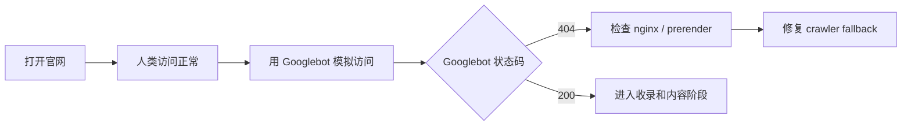

# Day 1 — SEO 体检：先让网站可被理解和抓取

日期: 2026-06-18

阶段: 第 1 周 — 账号和基础环境准备

状态: 已完成


## 背景

SandBase.ai 的 30 天运营不是从发帖开始，而是从官网基础盘开始。

如果官网的 title、description、canonical、sitemap、robots、移动端体验和核心页面结构都不清楚，后面再多社媒和外链，也很难形成稳定增长。

第一天的目标是让 Google 和开发者都能看懂：

```text
SandBase 是面向 production AI agents 的 agent infrastructure 平台。
```

## 目标

完成官网 SEO 基础体检，明确哪些地方已经可以上线，哪些地方需要修复。

重点不是“刷关键词”，而是确认网站是否具备被抓取、被索引、被分享、被信任的基础条件。

## 给小白的话

SEO 第一天不是写文章，而是先确认 Google 能不能进门。

一个网站在人类浏览器里打开正常，不代表 Googlebot 看到的也是正常页面。

最简单的理解：

```text
先确认 Google 能看到网站，再谈怎么让 Google 喜欢网站。
```

## 流程图



## 使用工具

| 工具 | 用途 |
|------|------|
| Codex | 读取代码、检查页面结构、整理 SEO 清单 |
| Browser | 检查线上页面表现 |
| Google Search Console | 后续验证 sitemap 和收录 |
| 本地代码仓库 | 检查 title、metadata、sitemap、robots |

## 检查内容

第一天重点看这些：

- 首页 title / description 是否清晰
- H1 是否聚焦 `Agent infrastructure for production AI agents`
- 每个核心页面是否有唯一标题
- sitemap.xml / sitemap-index.xml 是否存在
- robots.txt 是否允许抓取
- canonical 是否正确
- OG image / favicon 是否正常
- 404、重定向、移动端速度是否有明显问题
- CTA 是否明确指向 Discord、Docs、Quickstart 或 Contact

## 决策

我们把第一阶段 SEO 定位为“可信基础设施”，不是“流量技巧”。

这意味着：

- 不堆关键词
- 不批量生成低质量文章
- 不为了收录制造无意义页面
- 优先让核心页面表达清楚

## 经验

第一天最重要的不是立刻拿到流量，而是让后面的每一次内容发布、社媒链接、外链提交都有一个可靠的官网承接。

SEO 的第一步不是写文章，是让网站像一个真实产品。
