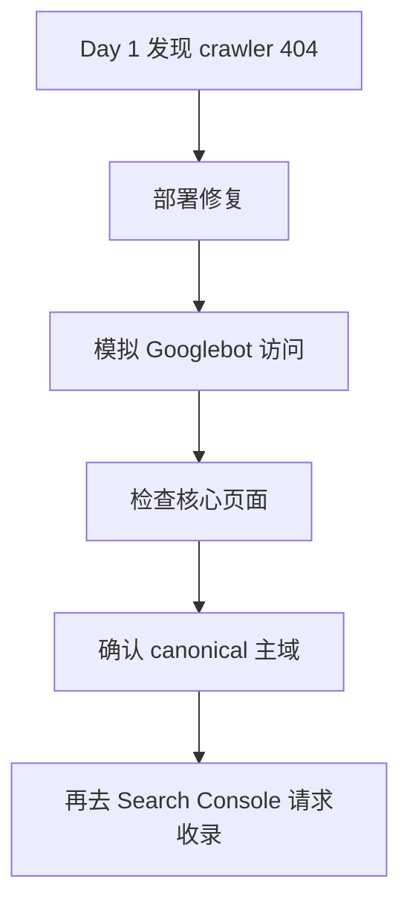

# Day 2 — 修复验证：把 SEO 检查变成可上线状态

日期: 2026-06-19

阶段: 第 1 周 — 账号和基础环境准备

状态: 已完成


## 背景

Day 1 找到的是问题和检查清单，Day 2 要做的是验证：线上是否真的能被 Google 正确读取。

这一天的重点不是继续增加页面，而是确认基础设施有没有闭环。

## 目标

完成 sitemap、robots、Search Console、核心页面和线上访问路径的验证。

## 给小白的话

修复 bug 不等于事情结束。

Day 2 做的是“站在 Google 视角复查”。只有 Googlebot 拿到 200，canonical 主域清楚，sitemap 正常，才适合继续提交收录。

最简单的理解：

```text
不要让 Google 重新检查一个还没修好的页面。
```

## 流程图



## 使用工具

| 工具 | 用途 |
|------|------|
| Google Search Console | 提交和检查 sitemap |
| Browser | 验证线上页面 |
| Codex | 对照 Day 1 清单做验收 |
| 本地文档 | 记录问题和结论 |

## 验证重点

- `https://www.sandbase.ai/sitemap-index.xml` 可访问
- sitemap 能被 Search Console 接收
- robots 没有阻止关键页面
- blog/docs/homepage 可访问
- CTA 路径有效
- 页面定位和标题一致

## 重要判断

我们确认 sitemap 本身是正常的，不应该因为 Search Console 的短暂状态就误判为代码问题。

这类验证很重要，因为早期运营很容易在工具状态里绕圈。正确做法是：

1. 先验证线上 URL 是否正常。
2. 再看 Search Console 是否接受。
3. 最后记录等待 Google 处理的部分。

## 经验

SEO 修复不是“改完代码就结束”。

真正结束是：

- 线上 URL 正常
- Search Console 能提交
- sitemap 结构合理
- 团队知道哪些问题是代码问题，哪些只是搜索引擎处理延迟

Day 2 给后面内容和外链分发打下了可验证基础。
