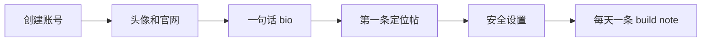

# Day 3 — 创建 X 账号：让项目有每日 build signal

日期: 2026-06-19

阶段: 第 1 周 — 账号和基础环境准备

状态: 已完成

## 背景

官网和 Search Console 只是让 SandBase 可被发现。X 的作用是让外界看到项目在持续建设。

对 SandBase 这种 AI infrastructure 产品来说，X 不适合一开始就疯狂贴链接。它更适合作为每日 build note 和技术观点的轻量渠道。

## 目标

创建并完善 SandBaseAI 的 X 账号，让它看起来像一个真实、稳定、技术导向的品牌账号。

公开账号：

https://x.com/SandbaseAI

## 给小白的话

新 X 账号最怕一上来像营销号。

第一天不需要追求曝光，而是先让账号像一个真实项目：

- 有头像
- 有官网
- 有清楚 bio
- 有一条定位帖
- 不疯狂关注
- 不疯狂贴链接

## 流程图



## 使用工具

| 工具 | 用途 |
|------|------|
| X | 品牌账号和每日 build note |
| Browser | 账号资料和安全设置 |
| Codex | Bio、首帖、节奏和风控建议 |

## 做了什么

- 创建品牌账号
- 上传头像和基础资料
- 设置官网链接
- 写清楚 bio
- 发第一条定位帖
- 建议开启 2FA
- 确认新号当天不要过度操作

## 首帖策略

第一条不贴大量链接，而是讲清楚 SandBase 在做什么：

```text
Building SandBaseAI: agent infrastructure for production AI agents.
```

重点是让后来访问主页的人一眼知道：

- 这是 Agent infra
- 面向 production AI agents
- 关注 sandboxed runtime、tool access、model routing、distributed compute

## 运营规则

新账号第一阶段：

- 每天 1 条 build note
- 少贴链接
- 少量高质量互动
- 不大量关注
- 不频繁改资料
- 不群发推广

## 经验

X 对 SandBase 的作用不是立刻带来大流量，而是建立“这个项目每天都在推进”的信号。

早期最重要的是稳定、真实、技术感，而不是热闹。

## 可传播文案

```text
SandBase.ai 30 天运营 Day 3：

我们创建了 X 账号，但没有急着做增长。

新账号第一天只做几件事：
头像、官网、bio、一条定位帖、安全设置。

对技术品牌来说，第一步不是热闹，是可信。
```
