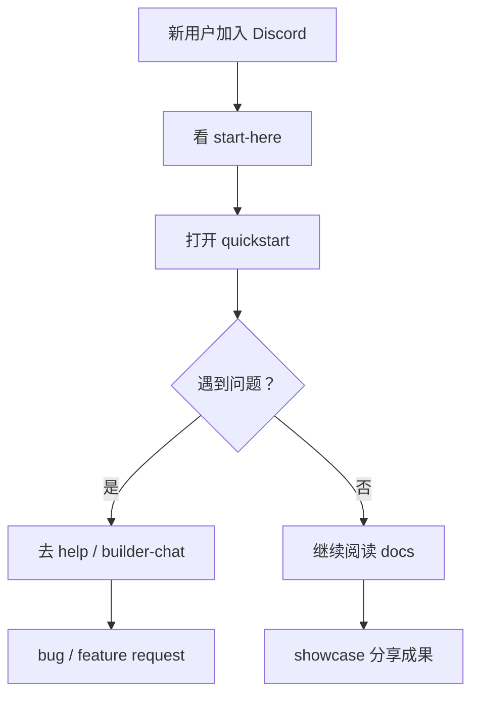

# Day 4 — Discord 社区：让开发者能连接、提问和反馈

日期: 2026-06-19

阶段: 第 1 周 — 账号和基础环境准备

状态: 已完成


## 背景

Discord 不是简单建一个群。

对 SandBase 来说，它是：

- 开发者社区入口
- 用户反馈入口
- 早期支持入口
- 产品可信度信号
- 官网和社媒的转化入口

目标不是做一个很大的社区，而是做一个简单、有影响力、权限可控的 builder community。

## 目标

把 SandBase Discord 从“频道骨架”变成一个能承接早期开发者的小型社区。

## 给小白的话

Discord 的价值不在于频道多，而在于新人进来后不迷路。

一个好的早期社区应该让用户马上知道：

- 从哪里开始
- 去哪里看文档
- 去哪里提问
- 去哪里反馈 bug
- 去哪里看公告

## 流程图



## 使用工具

| 工具 | 用途 |
|------|------|
| Discord | 社区、反馈和支持入口 |
| Browser / Computer Use | 巡检频道、角色、权限、安全设置 |
| Codex | 社区结构 review、权限建议、内容模板和复盘 |

## 初始结构

当时已经有清晰骨架：

```text
START HERE
- welcome
- announcements
- resources

COMMUNITY
- general
- introductions

BUILDERS
- tech-talk
- dev-help
- showcase

FEEDBACK
- bug-reports
- feature-requests
```

这个方向是对的，但还需要补承接内容、角色和权限。

## 主要优化点

- `welcome / announcements / resources` 需要首屏内容
- `@everyone` 默认权限要收紧
- 新增 `Founder / Team / Moderator / Builder / Bot` 等角色
- `announcements` 保持只读
- 后续公开推广前补 Server Rules、Verification Level、AutoMod

## 最终判断

权限核心风险已经控制住：

- 普通成员不能管理频道、角色或服务器
- 普通成员不能创建邀请
- 普通成员不能 @everyone/@here
- 普通成员不能创建私密线程
- 普通成员没有管理员权限

适合先对朋友、早期用户和开发者小圈子发邀请。

## 经验

早期社区不需要热闹，先要清楚。

一个开发者进来后，要马上知道：

- SandBase 是什么
- 从哪里开始
- 去哪里提问
- 去哪里报 bug
- 去哪里看更新

这比堆很多空频道更重要。
