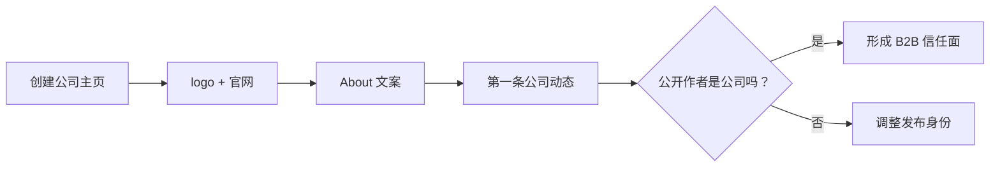

# Day 5 — LinkedIn 公司主页：建立 B2B 可信度

日期: 2026-06-19

阶段: 第 1 周 — 账号和基础环境准备

状态: 已完成

## 背景

LinkedIn 和 X 的作用不一样。

X 是 build signal，LinkedIn 是 B2B trust surface。

当客户、投资人、合作伙伴或候选人搜索 SandBase 时，一个完整的 LinkedIn 公司主页能证明：这不是只有一个 landing page 的匿名项目。

## 目标

创建 SandBaseAI 公司主页，完善基础信息，并发布第一条公司动态。

公开主页：

https://www.linkedin.com/company/sandbaseai/

## 给小白的话

LinkedIn 对 B2B 产品来说不是“多一个社媒账号”。

它解决的是一个信任问题：

```text
别人搜索你时，会不会觉得这是一个真实公司？
```

所以公司主页、作者身份、管理员隐私都要认真处理。

## 流程图



## 使用工具

| 工具 | 用途 |
|------|------|
| LinkedIn | 公司主页、B2B 信任、官方动态 |
| Browser | 页面创建、资料填写、发布确认 |
| Codex | 公司介绍、隐私判断、管理员操作建议 |

## 做了什么

- 创建公司主页
- 上传 logo
- 设置 tagline
- 设置官网链接
- 补 industry、company size、company type
- 写 About
- 设置 Message / Website CTA
- 发布第一条公司动态

## 第一条公司动态

主题不是硬推广，而是说明方向：

```text
SandBaseAI is building agent infrastructure for developers working on production AI agents.
```

重点表达：

- sandboxed runtime
- tool access
- model routing
- distributed compute
- helping agents move from demos to reliable systems

## 隐私和管理员决策

这一天有一个重要问题：创始人不希望某个个人大号公开和 SandBase 关联。

我们确认：

- 普通访客看到的是 SandBaseAI 公司主页
- 公司动态显示作者是 SandBaseAI
- LinkedIn 内部会知道管理员操作
- 普通用户看不到后台管理员列表

添加运营账号做管理员时，因为搜索结果有同名歧义，我们没有冒险选择。

原则：

```text
品牌公开面优先。
管理员便利性第二。
身份不明确时不猜。
```

## 经验

LinkedIn 不是普通社媒账号，它是可信度资产。

对 SandBase 这种 B2B infra 产品来说，公司主页的作用是让外界看到一个清晰、稳定、专业的公司身份。

## 可传播文案

```text
SandBase.ai 30 天运营 Day 5：

我们创建了 LinkedIn 公司主页。

不是为了多一个账号，而是为了 B2B 信任。

当客户、候选人或合作方搜索公司时，他们需要看到一个清楚、稳定、专业的公开身份。
```
