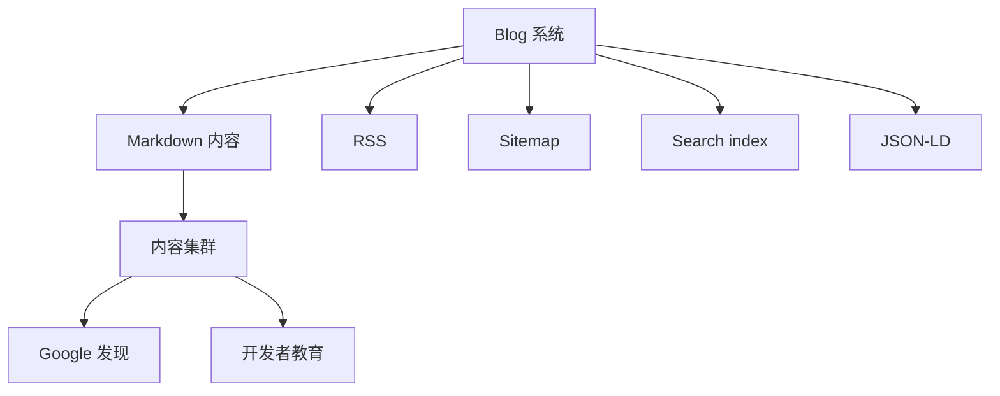

# Day 6 — Blog 系统：把内容当成技术分发基础设施

日期: 2026-06-18

阶段: 第 1 周 — 账号和基础环境准备

状态: 已完成

## 背景

SandBase 需要一个能承载长期技术内容的地方。

对 AI infrastructure 产品来说，Blog 不是新闻页，而是教育市场、解释品类、建立搜索权重的基础设施。

## 目标

把 `sandbase-blog` 作为技术内容引擎纳入第一周基础盘。

代码位置：

```text
sandbase-monorepo/sandbase-blog
```

线上入口：

https://www.sandbase.ai/blog/

## 给小白的话

Blog 不是“发文章的地方”这么简单。

对技术产品来说：

```text
官网解释产品。
Blog 解释问题空间。
```

如果 SandBase 要让市场理解 agent infrastructure，就需要一个能长期承载技术内容的系统。

## 流程图



## 使用工具

| 工具 | 用途 |
|------|------|
| Astro | 静态 Blog 系统 |
| Tailwind | 页面样式 |
| Astro sitemap / RSS | sitemap 和 RSS |
| Codex | 检查结构并提炼运营价值 |
| Markdown | 英文和中文内容库 |

## Blog 已具备的能力

- Astro 5
- Tailwind
- Markdown content collections
- 英文 / 中文双语内容
- RSS
- search index
- archive
- tag / category 页面
- sitemap
- canonical 处理
- JSON-LD
- Dockerfile / nginx config
- tests

这说明 Blog 不是临时页面，而是可以支撑长期内容运营的系统。

## SEO 价值

Blog 中几个关键设计很重要：

- 英文默认路径和 canonical 做了处理，避免 `/blog/en/...` 重定向 URL 出现在 sitemap
- tag/category/archive 等薄列表页不进 sitemap，避免和文章竞争
- 根据 frontmatter 生成准确 lastmod
- Article JSON-LD 支持 publisher、author、datePublished、dateModified、inLanguage

这些细节对技术内容长期收录很有价值。

## 经验

Blog 不是内容装饰，而是技术分发基础设施。

SandBase 要建立 agent infrastructure 的品类认知，就需要一个能持续承载 runtime、sandbox、tools、models、observability 等主题的内容系统。

## 可传播文案

```text
SandBase.ai 30 天运营 Day 6：

我们把 Blog 当成内容基础设施来做。

不是随便发文章。
而是 RSS、sitemap、双语内容、canonical、JSON-LD、topic clusters。

技术内容要能长期复利，先要有系统。
```
