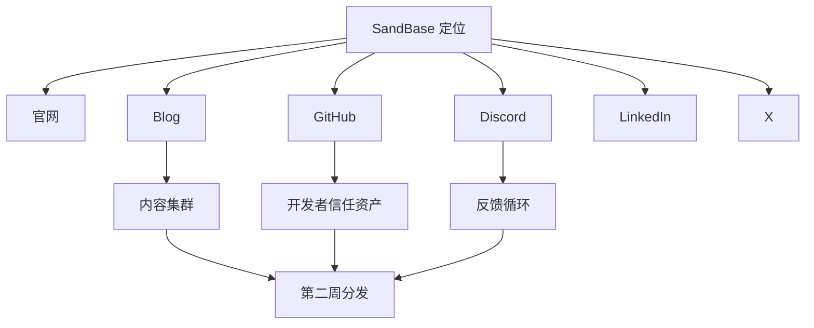

# Day 7 — 第一周收口：GitHub 信任资产和内容集群

日期: 2026-06-19

阶段: 第 1 周 — 基础盘收口

状态: 已完成

## 背景

第一周结束时，SandBase 已经具备几个关键公开面：

- 官网
- Docs
- Blog
- Search Console
- X
- Discord
- LinkedIn
- GitHub organization

最后一步是把这些基础面连接起来，形成开发者可信度。

## 目标

完成第一周基础盘收口：

- 创建一个 GitHub developer trust asset
- 把 Blog 内容规划成 topic clusters
- 为第二周目录提交和社区分发做准备

## 给小白的话

第一周不是“注册一堆账号”。

真正的目标是让所有公开渠道互相支撑：

```text
官网、Blog、GitHub、Discord、LinkedIn、X 讲同一个故事。
```

这样第二周对外分发时，别人点进任何一个入口，都能感受到 SandBase 是一个真实、持续建设的技术产品。

## 流程图



## GitHub 信任资产

仓库：

https://github.com/sandbaseai/awesome-native-agent-platforms

这个仓库不是产品代码，也不是广告页。

它是围绕 native agent platform / agent infrastructure 的生态资源列表，覆盖：

- agent infrastructure
- agent runtimes
- sandboxed execution
- browser infrastructure
- model routing
- protocol and tool integration
- agent frameworks

关键点：它包含 SandBase，但不只写 SandBase。

这样它才像一个对开发者有用的资源，而不是纯推广。

## 内容集群

Blog 内容围绕 5 个方向：

1. Agent Runtime
2. Sandbox and Secure Execution
3. Tools and MCP
4. Models and Routing
5. Observability and Guardrails

每个方向都对应 SandBase 的长期定位。

## 内链策略

每篇文章尽量链接到：

- 首页
- Docs / Quickstart
- Discord
- 同主题相关文章
- 未来 pillar content

未来 pillar：

```text
The Agent Infrastructure Stack: Runtime, Tools, Sandboxing, Models, and Observability
```

## 经验

第一周不是“注册一堆账号”。

它建立的是一个完整基础盘：

- 官网解释产品
- Blog 解释品类
- X 显示持续建设
- Discord 承接用户和反馈
- LinkedIn 建立 B2B 信任
- GitHub 提供技术资产

有了这个基础，第二周再做目录提交和社区分发才有意义。

## 可传播文案

```text
SandBase.ai 30 天运营第 1 周完成。

我们没有先追流量。

我们先搭可信基础盘：
官网、Blog、Search Console、X、Discord、LinkedIn、GitHub resource repo。

现在第二周的分发，才有东西可以承接。
```
