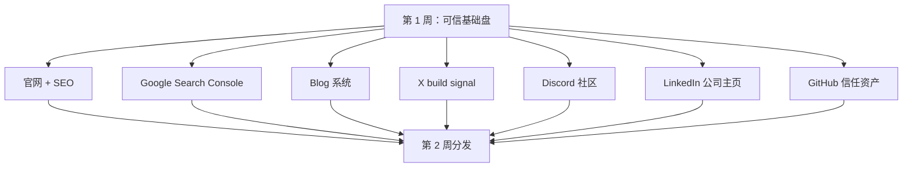

# 第 1 周复盘 — 先搭可信基础盘，再做分发

日期: 2026-06-19

## 最简单的理解

在邀请别人访问 SandBase 之前，我们要先保证别人点进来时，会觉得这是一个真实、持续建设的技术产品。

所以第 1 周不是做增长技巧。

第 1 周做的是可信基础盘：

- Google 能不能抓取网站？
- 官网有没有讲清楚产品？
- 有没有技术 Blog？
- 有没有公司主页？
- 有没有开发者社区？
- 有没有 GitHub 信任资产？
- 有没有每日 build signal？
- 所有渠道是不是讲同一个定位？

## 流程图



## 我们做了什么

| Day | 重点 | 产出 |
|-----|------|------|
| Day 1 | SEO 可抓取性 | 发现 crawler 404 风险 |
| Day 2 | 修复验证 | 验证 crawler response、canonical、Search Console |
| Day 3 | X | 创建每日 build signal |
| Day 4 | Discord | 搭建清晰的 builder community 入口 |
| Day 5 | LinkedIn | 创建 B2B 公司信任面 |
| Day 6 | Blog | 梳理技术内容系统 |
| Day 7 | GitHub + 内容集群 | 创建开发者信任资产和 topic clusters |

## 统一定位

所有公开渠道都围绕一句话：

```text
The infrastructure layer for developers building production AI agents.
```

这句话影响了：

- 首页 SEO
- X bio 和首帖
- Discord 频道结构
- LinkedIn 公司介绍
- Blog 内容集群
- GitHub resource repo

## 我们没有做什么

我们没有：

- 买外链
- 群发目录
- 过早 Product Hunt launch
- 在 Reddit / Hacker News 硬推广
- 批量发低质量 AI 内容
- 暴露私人账号信息
- 让 Codex 在未经确认时提交公开动作

## 第 2 周做什么

第 2 周可以开始分发，因为现在已经有真实资产可以承接。

下一步：

- 目录提交
- Dev.to 内容
- X / LinkedIn / Discord 日常运营
- 参与开发者社区讨论
- 记录问题和用户反馈
- 把重复问题转成内容选题

## 可传播文案

```text
SandBase.ai 30 天运营第 1 周完成。

我们没有先做增长技巧。

我们先搭可信基础盘：
官网 SEO、Search Console、Blog、X、Discord、LinkedIn、GitHub resource repo。

现在第 2 周的分发，才有东西可以承接。

完整记录：
https://github.com/sandbaseai/zero-to-one-ai-infra-growth
```
